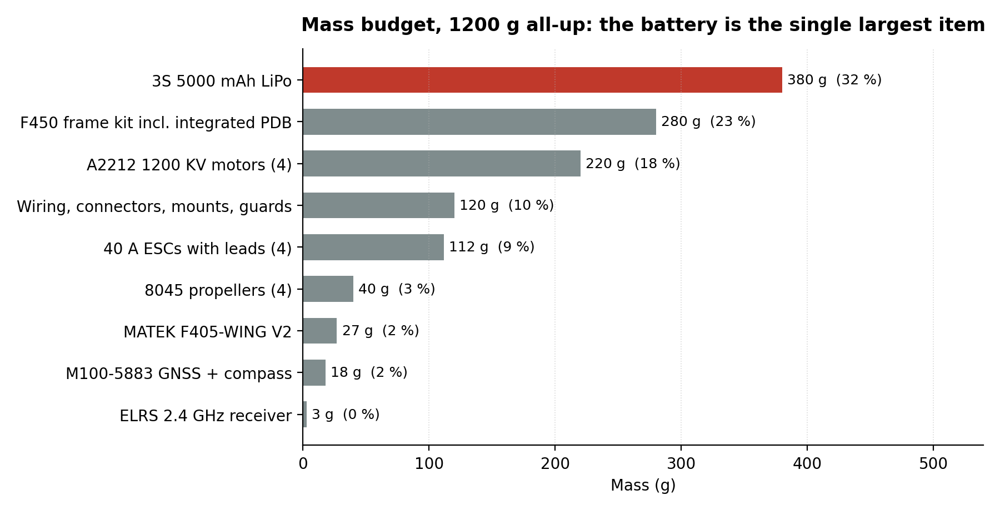

# Bill of materials

Costs are as paid in early 2026 and rounded. Masses are catalogue figures for the exact parts fitted, except where marked as estimated. The total should be confirmed on a scale; it is the input that propagates furthest through [`docs/calculations.md`](docs/calculations.md).

---

## Components

| Subsystem | Component | Key parameters | Mass | Cost |
|---|---|---|---|---|
| Frame | F450 V1 kit | 450 mm motor to motor, integrated PDB | 280 g | $20 |
| Flight controller | MATEK F405-WING V2 | STM32F405RGT6 at 168 MHz, ICM42605 IMU, SPL06 baro, 6 UARTs | 27 g | $40 |
| ESC, 4 off | 40 A brushless, 5 V / 3 A BEC | 2-4S input, BLHeli compatible | 112 g | $20 |
| Motor, 4 off | A2212/11T BLDC | 1200 KV, 12 A continuous, X-config CW/CCW pairs | 220 g | $20 |
| Propeller, 4 off | 8 x 4.5 fixed pitch | 2 CW, 2 CCW | 40 g | $5 |
| GNSS and compass | HGLRC M100-5883 | u-blox M10 GNSS, QMC5883L magnetometer at 0x0D | 18 g | $20 |
| Receiver | ExpressLRS 2.4 GHz | CRSF, ~150 mW | 3 g | $10 |
| Battery | 3S LiPo 5000 mAh | 11.1 V nominal, 12.6 V full, XT60 | 380 g | $30 |
| Sundries | Wiring, connectors, mounts, printed guards | Estimated | 120 g | included |
| | | **Total** | **≈ 1200 g** | **≈ $165** |

---

## What the mass budget says

The battery is 32 % of all-up weight. That single line sets the thrust-to-weight ratio, the endurance and the roll inertia, and it is the only component in the list whose specification is a free choice rather than a consequence of the airframe.

A 3S 3000 mAh pack would save roughly 150 g, taking all-up weight to about 1050 g and thrust-to-weight from 1.93 to 2.21 continuous. Endurance would fall from 13 minutes to about 9. Whether that is a good trade depends on whether the vehicle is short of energy or short of control authority, and on this airframe it is short of control authority. This is worth revisiting after the vehicle is weighed and after finding 1 is resolved, since a faster actuator loop changes how much authority the margin buys.

---

## Sizing observations

| Item | Rating | Actual demand | Comment |
|---|---|---|---|
| ESC | 40 A | 12 A continuous per motor | Oversized 3.3x. See [finding 2](README.md#finding-2-the-esc-cannot-protect-the-motor): it cannot protect the motor |
| XT60 connector | 60 A continuous | 60 A at full throttle | Exactly at rating. Acceptable because full throttle is momentary |
| Battery | 5000 mAh | 18.4 A at hover (3.7 C) | Comfortable. Even full throttle is only 12 C |
| PDB traces | F450 integrated | 15 A per arm peak | Within the kit's design intent |
| Motor | 12 A continuous | 6 A at hover | 50 % of rating at hover, which is where a multirotor should sit |

---

## Not fitted, but wanted

| Item | Why | Roadmap |
|---|---|---|
| microSD or onboard flash logging | Turns the next fault into a spectrum plot instead of a four-hypothesis elimination | Item 2 |
| 915 MHz MAVLink telemetry radio | Real-time state monitoring and a way to check the estimator against sensor data | Item 5 |
| Propeller guards | Currently unguarded at 7000 rpm | Under consideration |
| 20-30 A ESCs | Correctly sized for a 12 A motor, and saves about 30 g | Deferred, the 40 A units work |
