# F450 GPS Quadcopter

**A 450 mm quadcopter built from discrete components as a study of the embedded flight-control stack: subsystem bring-up, I2C debugging, fault isolation, and GPS-assisted position hold with return-to-home.**

**Nguyễn Minh Khôi** · Oregon State University
Rev. B · Built February to March 2026, Auburn, Alabama

> **Scope of work.** Solo project. Component selection follows a published open build (credited in [Acknowledgements](#acknowledgements)); the bring-up methodology, the validation firmware, the fault investigation, the analysis in `analysis/` and this documentation are my own.

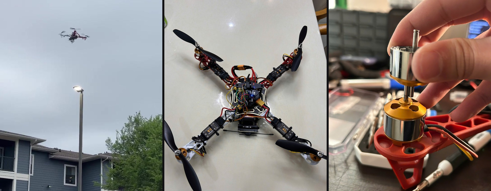

---

## Overview

The vehicle flies. That is the least interesting thing about it.

What this repository documents is the process of getting there: four bring-up phases in which every subsystem was proven on a bench before it was allowed near the airframe, one integration bug that took a scanner sketch to find, and one failure that survived three correct-looking diagnostic tests before the fourth hypothesis caught it. The failure investigation is the part worth reading, and it is [the fault investigation](#fault-investigation-roll-divergence-at-throttle-up).

Rev. B adds what the first version of this write-up lacked: **numbers**. The original claimed the antenna relocation cost "a measurable but tolerable" amount of RF performance, that the vehicle held position "within 1 to 2 m", and that a motor with axial play produced "the correct rotation but not the correct thrust". Those are all true. None of them were quantified. Every one of them now has a model behind it in [`analysis/`](analysis/), including one finding that changes how the vehicle should be configured.

> **No instrumentation was fitted.** There is no blackbox logging, no thrust stand, no wattmeter and no telemetry downlink on this airframe. Every performance figure below is an analytical prediction from catalogue parameters and first principles, not a measurement. [`docs/verification.md`](docs/verification.md) lists what each prediction would cost to confirm, cheapest first.

---

## Repository map

| Path | Contents |
|---|---|
| [`docs/calculations.md`](docs/calculations.md) | Every number in this README, worked out with assumptions stated |
| [`docs/design-notes.md`](docs/design-notes.md) | Component choices and the reasoning behind the two hardware revisions |
| [`docs/bring-up.md`](docs/bring-up.md) | The four bring-up phases, with photographs |
| [`docs/fault-analysis.md`](docs/fault-analysis.md) | The roll divergence investigation in full |
| [`docs/i2c-debug.md`](docs/i2c-debug.md) | The magnetometer that would not enumerate, and the bus analysis around it |
| [`docs/verification.md`](docs/verification.md) | How to turn each prediction into a measurement |
| [`docs/regulatory.md`](docs/regulatory.md) | Why autonomous waypoint missions are not enabled |
| [`BOM.md`](BOM.md) | Bill of materials with mass and cost breakdown |
| [`analysis/`](analysis/) | Python models. Run them and they regenerate every figure and table |
| [`firmware/`](firmware/) | Arduino sketches used for pre-integration validation |
| [`inav_config/`](inav_config/) | INAV port map, sensor configuration, CLI dump |
| [`images/`](images/) | Build photographs at full resolution |

---

## Specifications

| Parameter | Value | Source |
|---|---|---|
| Airframe | F450, 450 mm motor to motor, integrated PDB | Measured |
| Flight controller | MATEK F405-WING V2, STM32F405RGT6 at 168 MHz | Board marking |
| Onboard sensors | ICM42605 6-axis IMU, SPL06 barometer | INAV detection |
| External sensors | M100-5883: u-blox M10 GNSS over UART, QMC5883L compass on I2C at 0x0D | Bus scan |
| Firmware | INAV 9.0.1, target `MATEKF405SE` | Configurator |
| Motors | A2212/11T, 1200 KV, 4 off | Motor label |
| Propellers | 8 x 4.5 fixed pitch, 2 CW and 2 CCW | Measured |
| ESCs | 40 A, 2-4S, 5 V / 3 A BEC, 4 off | ESC label |
| Battery | 3S 5000 mAh LiPo, XT60 | Pack label |
| Control link | ExpressLRS 2.4 GHz, CRSF over UART at 115200 baud | Configuration |
| **All-up weight** | **≈ 1200 g** (estimate, see below) | Mass budget |
| **Hover point** | **≈ 7180 rpm per rotor, 300 g of thrust each** | [Calculated](docs/calculations.md#2-hover-point) |
| **Thrust-to-weight** | **1.93 continuous, 2.24 burst** | [Calculated](docs/calculations.md#3-thrust-margin) |
| **Predicted endurance** | **13 to 16 min hover** | [Calculated](docs/calculations.md#4-power-and-endurance) |
| Demonstrated | Angle mode, altitude hold, GPS position hold, return-to-home | Flight log |

The all-up weight is built up from catalogue component masses, not weighed. It propagates into thrust-to-weight, endurance and the fault model, which makes putting the vehicle on a kitchen scale the highest-value five seconds available in this project.

---

## Architecture

```
                 2.4 GHz                                    ┌── ESC 1 ──> Motor 1 (CW)
   Transmitter ~~~~~~~~~~> ELRS RX ──CRSF/UART1──┐          ├── ESC 2 ──> Motor 2 (CCW)
                                                 │          ├── ESC 3 ──> Motor 3 (CW)
   u-blox M10 GNSS ──────UBLOX/UART3─────────────┤          └── ESC 4 ──> Motor 4 (CCW)
                                                 │                    ^
   QMC5883L compass ─────I2C @ 0x0D──────────────┤   MATEK            │
                                                 ├── F405-WING ───────┘  motor output
   ICM42605 IMU ─────────SPI (onboard)───────────┤   STM32F405            protocol
   SPL06 baro ───────────I2C (onboard)───────────┘        │            (see finding 1)
                                                          │
   3S 5000 mAh ──XT60──> PDB ──┬── 4 x ESC at pack voltage │
                               └── BAT/ESC pad ──> 5 V and 3.3 V BECs ──> FC and peripherals
```

The compass is external, on the GNSS mast, rather than using an onboard magnetometer. Motor commutation currents of 10 to 15 A per arm produce magnetic fields that fall off roughly as the cube of distance; moving the magnetometer 150 mm away from the power wiring is worth two orders of magnitude of interference on the heading estimate, and heading error is what makes a GPS-mode vehicle drift in slow circles.

---

## Predicted performance

Two independent methods are used for thrust and cross-checked against each other: momentum theory, which bounds the induced power of an ideal actuator disc, and the Staples static-thrust correlation, which gives thrust from rotor speed. The correlation was validated against published APC data before use, predicting 468 g for a 10 x 4.7 at 6000 rpm against a measured 460 to 500 g.

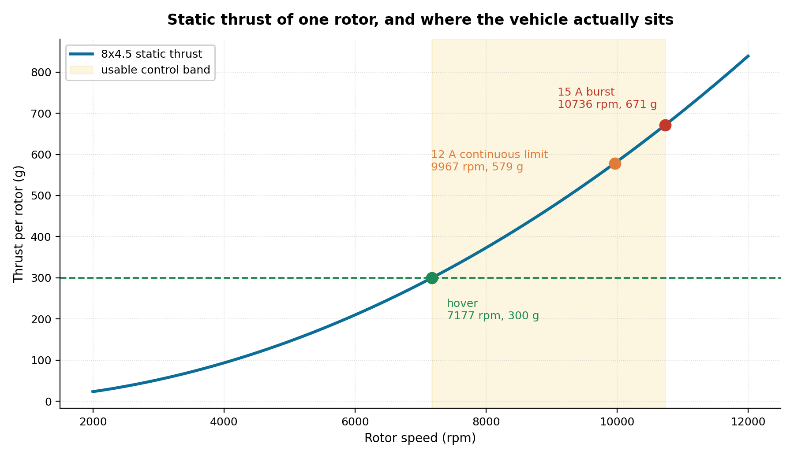

### Where the vehicle sits

| Quantity | Value |
|---|---|
| Thrust required per rotor at hover | 2.94 N (300 g) |
| Rotor speed at hover | 7177 rpm, 54 % of unloaded speed |
| Blade tip speed | 76 m/s, Mach 0.22 |
| Blade Reynolds number at 0.75 R | 70 000 |
| Disc loading | 91 N/m² (9.3 kg/m²) |
| Induced velocity through the disc | 6.1 m/s |

A blade Reynolds number of 70 000 is deep in the low-Reynolds regime, where sectional lift-to-drag collapses. That is why the model uses a figure of merit of 0.50 rather than the 0.7 to 0.8 typical of full-scale rotors, and it is a real efficiency penalty that small multirotors pay and cannot design around.

### The ceiling is thermal, not kinematic

| | Continuous (12 A) | Burst (15 A) |
|---|---|---|
| Thrust per rotor | 5.67 N (579 g) | 6.58 N (671 g) |
| Implied rotor speed | 9967 rpm | 10736 rpm |
| Back-EMF at that speed | 8.31 V | 8.95 V |
| Thrust-to-weight ratio | **1.93** | **2.24** |

The A2212 runs out of current headroom with rotor-speed headroom still on the table. At 12 A the rotor needs 8.3 V of back-EMF against a pack sitting near 11.1 V under load, so roughly a quarter of the available voltage is never used. The motor is the limit, and the limit is heat.

### Power and endurance

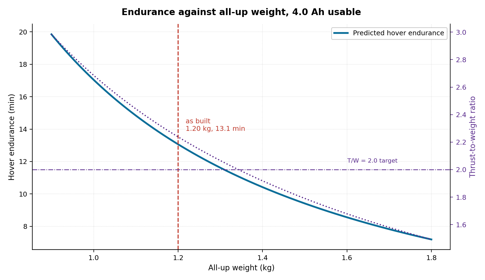

| Quantity | Value |
|---|---|
| Total electrical power at hover | 204 W |
| Hover current at 11.1 V | 18.4 A (3.7 C) |
| Full-throttle current | 60 A (12 C) |
| Predicted hover endurance | 13.1 min at a lumped 72 % drivetrain efficiency |
| | 16 min if the detailed motor model at 86 % is nearer the truth |

Endurance is quoted as a band because the lumped efficiency assumption is the loosest number in the model. A detailed motor calculation using the back-EMF constant and winding resistance gives 86 %, which would put hover current near 15 A and endurance near 16 minutes. Both bracket the 12 to 18 minutes that F450 builds on this pack typically report.

### Wind authority

| Wind | Aerodynamic drag | Tilt required | Thrust required | Share of maximum |
|---|---|---|---|---|
| 10 mph | 0.61 N | 3.0° | 11.78 N | 39 % |
| 15 mph | 1.38 N | 6.7° | 11.85 N | 39 % |
| 20 mph | 2.45 N | 11.8° | 12.02 N | 40 % |
| 30 mph | 5.51 N | 25.1° | 12.99 N | 43 % |

Holding position in the 15 to 20 mph wind that the flight tests were conducted in requires about 11 degrees of tilt and 2 % extra thrust. **Wind was never the limiting factor.** The limit on how tightly this vehicle holds a point is the bandwidth of its attitude loop, which brings us to the finding.

---

## Findings

Three things the analysis surfaced that the build itself did not.

### Finding 1: the motor output protocol may be eating the entire phase margin

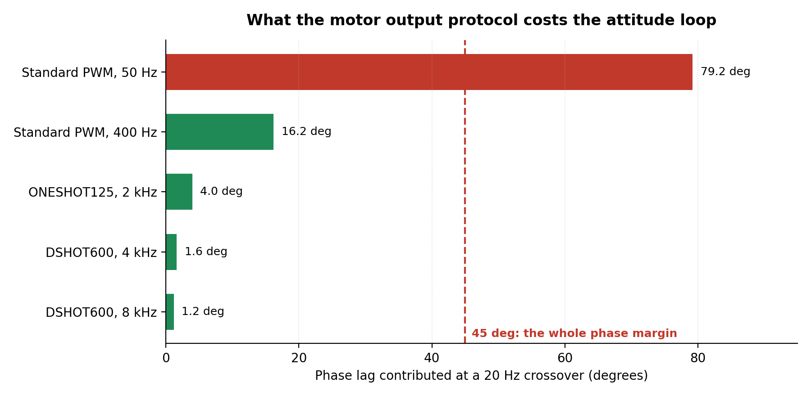

A control loop is only as fast as the actuator it drives. A zero-order hold at rate *f* contributes an average latency of 1/(2*f*), and latency becomes phase lag in proportion to frequency. Evaluated at a 20 Hz rate-loop crossover, which is representative for a 450 mm airframe:

| Protocol | Update rate | Latency | Phase cost at 20 Hz |
|---|---|---|---|
| Standard PWM | 50 Hz | 11.0 ms | **79.2°** |
| Standard PWM | 400 Hz | 2.25 ms | 16.2° |
| ONESHOT125 | 2 kHz | 0.55 ms | 4.0° |
| DSHOT600 | 8 kHz | 0.16 ms | 1.2° |

A stable loop has roughly 45 degrees of phase margin to spend in total, shared between the actuator, the gyro filters and the controller itself. At 50 Hz the actuator alone is over budget before anything else is counted. Adding the gyro low-pass (12.5° at a 90 Hz corner) and the 1 kHz PID discretisation (3.6°) gives 95° of total lag at 50 Hz against 32° at 400 Hz.

**50 Hz is a servo rate.** It is the correct default for the fixed-wing role this board is named for, and it is the wrong one for a multirotor. The system diagram in the original write-up described the motor drive as 50 Hz PWM, which may have been loose wording rather than the actual configuration, so this is an action rather than a confirmed defect: **read `motor_pwm_protocol` and `motor_pwm_rate` out of the CLI dump.** If the ESCs accept DSHOT600, moving to it removes this term from the budget completely and, as a side effect, removes ESC throttle calibration as a source of arm-to-arm asymmetry, which is directly relevant to finding 3.

### Finding 2: the ESC cannot protect the motor

The ESCs are rated 40 A. The A2212 is rated 12 A continuous. The ESC is sized for a motor three times larger than the one fitted, which means **no motor fault will ever trip it.** A fouled propeller, a dragging bearing or a bound bell will take the winding to its thermal limit while the ESC reports a perfectly normal 30 % of its own rating.

This is the same shape of error as fitting a 16 A breaker in front of a 6 A load: the protective device exists, it is correctly rated for itself, and it protects nothing downstream. On a vehicle whose thrust-to-weight ratio is already marginal, the 40 A parts also carry about 30 g of mass that a correctly sized 20 A ESC would not.

Separately, four ESCs each carry a 5 V / 3 A BEC while the flight controller has its own regulators. If more than one BEC output is connected to the FC's 5 V rail, they are in parallel and the one with the highest output voltage carries the entire load while the others idle into their own regulation loops. Standard practice is to remove the red wire from three of the four servo leads, or all four. **This needs a continuity check.**

### Finding 3: full throttle draws the connector's entire rating

Four motors at 15 A burst is 60 A, which is exactly the continuous rating of an XT60. This is acceptable because full throttle on a hovering platform is momentary, and it is the reason the connector is noticeably warm after an aggressive flight. It is worth knowing rather than fixing.

---

## The control link, quantified

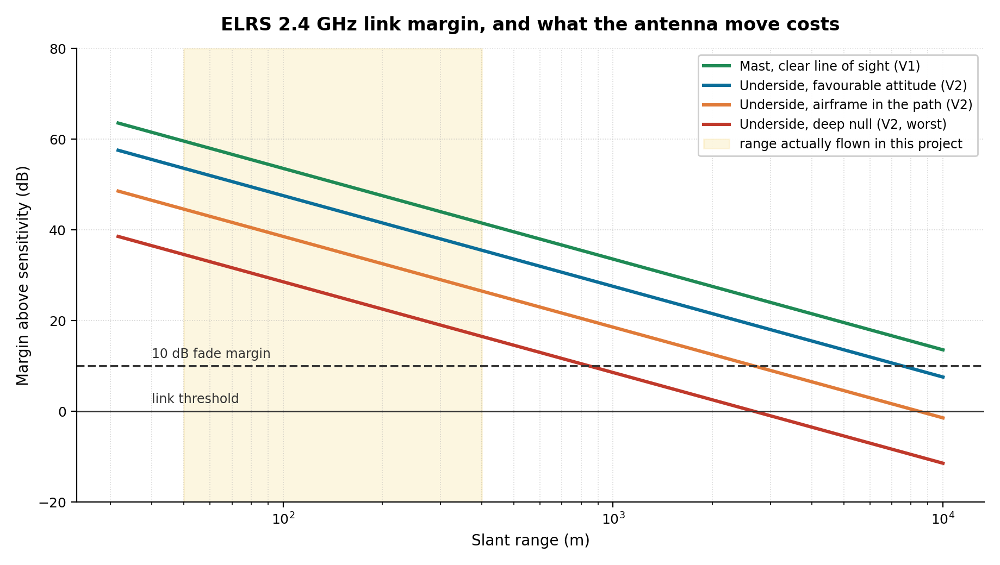

The V2 revision moved both receiver antennas from a mast above the flight controller to the underside of the frame, because the mast broke in every crash. The original write-up called the cost "measurable but tolerable". Here is the number.

| Antenna scenario | Range at a 10 dB fade margin | Relative to V1 |
|---|---|---|
| Mast, clear line of sight (V1) | 15.1 km | 100 % |
| Underside, favourable attitude (V2) | 7.6 km | 50 % |
| Underside, airframe in the path (V2) | 2.7 km | 18 % |
| Underside, deep null (V2, worst case) | 849 m | 6 % |

The relocation costs between half and 94 % of the theoretical range depending on vehicle attitude. It sounds severe and it does not matter: every flight in this project has been line-of-sight inside a few hundred metres, where even the worst-case null leaves 29 dB of margin. **The relocation spends margin the vehicle was never using.** That is what makes it a good engineering trade rather than merely a convenient one, and it is a conclusion that could not be reached without doing the arithmetic.

The honest caveat is that free-space path loss is optimistic near the ground, where reflection nulls and Fresnel-zone obstruction dominate. The comparison between the two antenna positions still holds, because both suffer those effects equally.

---

## Bring-up

Four phases, each producing a subsystem that was demonstrably correct before the next added complexity on top of it. This is slower than wiring the vehicle together and turning it on, and it means every fault that appears later is an integration fault rather than an unknown bad component.

<table>
<tr>
<td width="50%">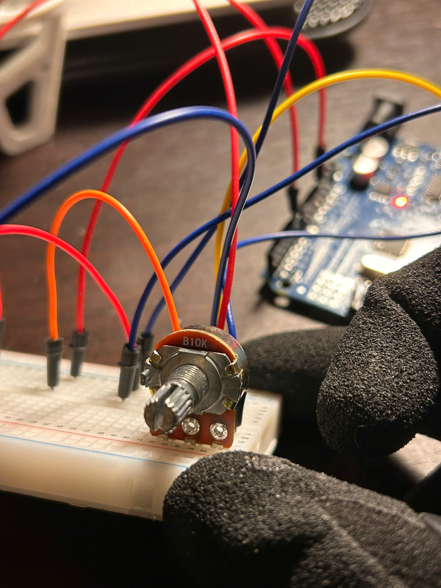</td>
<td width="50%">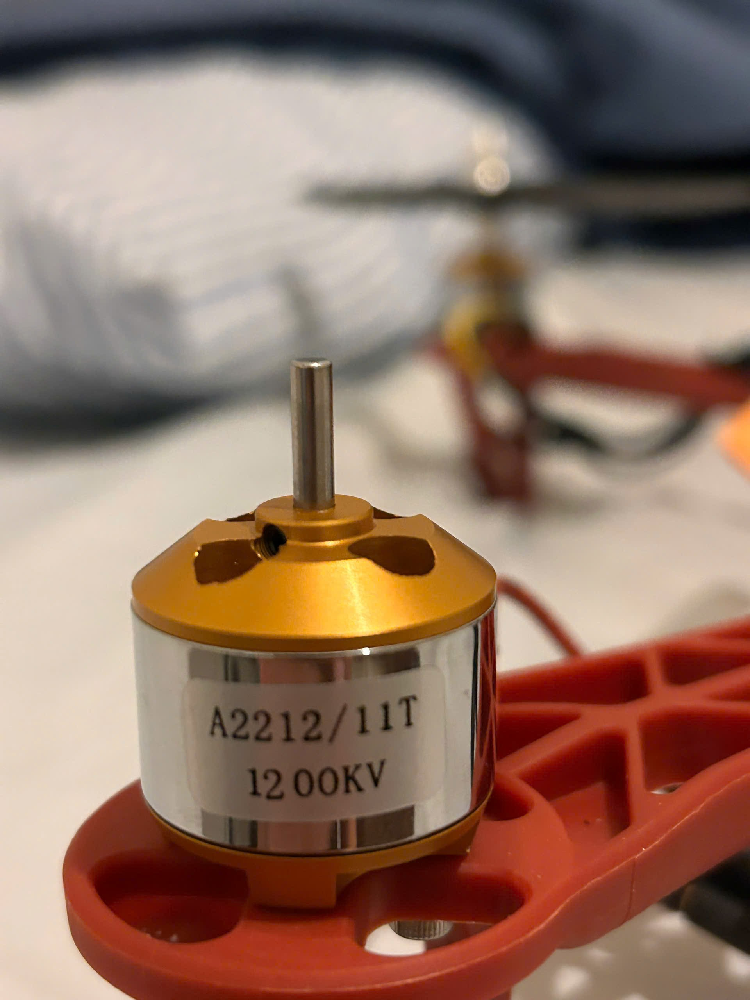</td>
</tr>
<tr>
<td><b>Phase 1: ESC and motor characterisation.</b> Before the flight controller arrived, each ESC and motor pair was driven from an Arduino UNO with a B10K potentiometer on the ADC, mapped to the 1000 to 2000 µs pulse range. The arming sequence was written out explicitly rather than relied upon. Sketch in <a href="firmware/esc_motor_test/esc_motor_test.ino"><code>firmware/</code></a>.</td>
<td><b>The motor under test.</b> A2212/11T, 1200 KV. This phase confirmed that the pack could supply ESC inrush, that the arming sequence was being met, and that all four pairs responded smoothly across the throttle range.</td>
</tr>
<tr>
<td>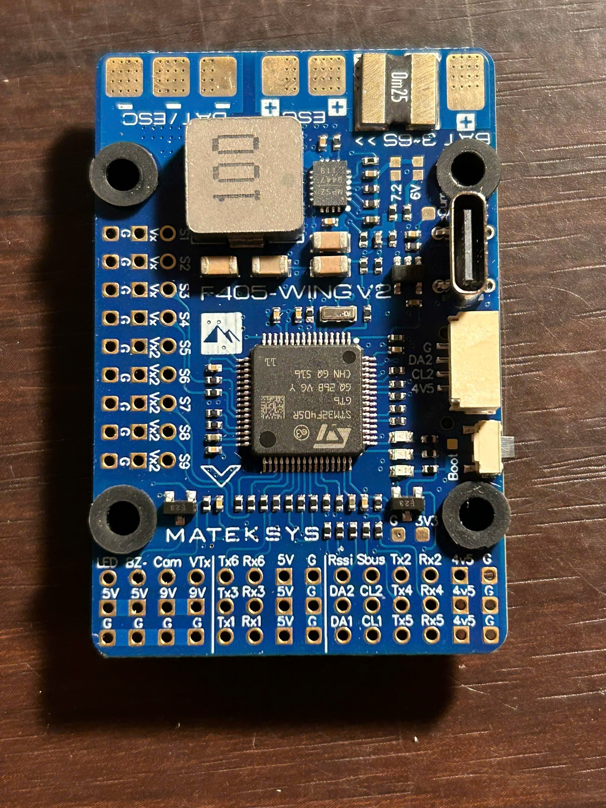</td>
<td></td>
</tr>
<tr>
<td><b>Phase 2: flight controller integration.</b> MATEK F405-WING V2 flashed with INAV 9.0.1. Quadcopter X mixer, battery monitor calibrated against a multimeter to within 0.05 V, ELRS on UART1 at CRSF. Default PIDs kept, tuning deferred until a stable hover existed to tune against.</td>
<td><b>Sensor detection.</b> ICM42605 accelerometer, SPL06 barometer and QMC5883 magnetometer all present, I2C at 400 kHz.</td>
</tr>
<tr>
<td></td>
<td>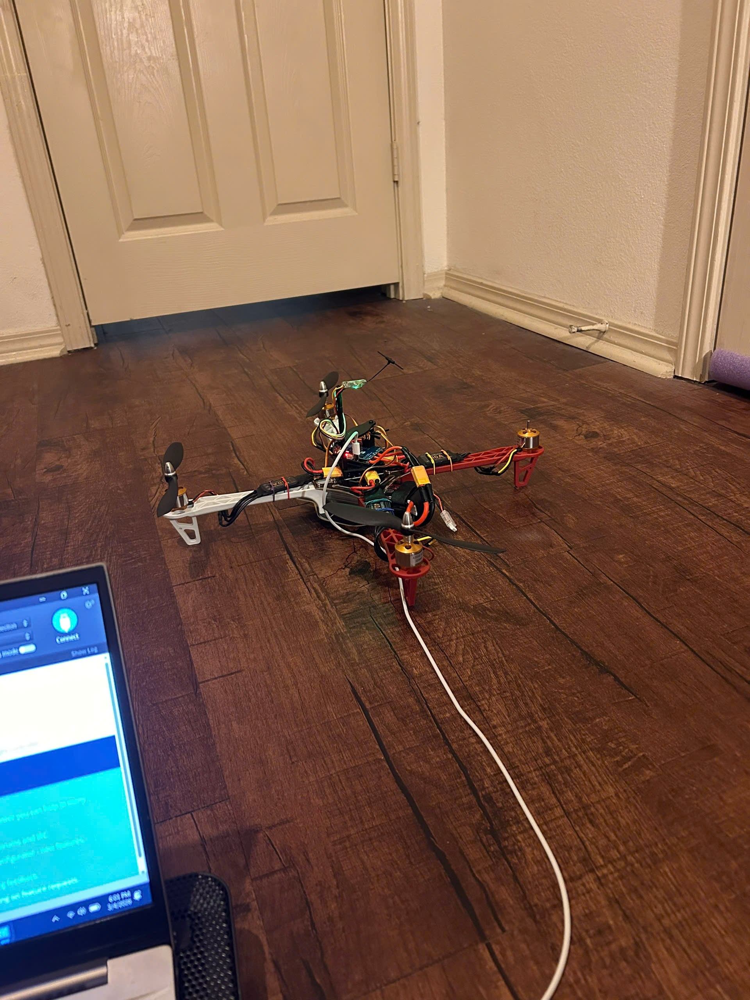</td>
</tr>
<tr>
<td><b>Phase 3: GNSS and compass.</b> INAV found the GPS and not the compass. Rather than swap the module, an Arduino ran an I2C scanner on the same physical bus and returned a single device at <code>0x0D</code>: the QMC5883L, not the 0x1E of the legacy HMC5883L that the "5883" in the module name suggests. Two chips sharing a number is a supply-chain artefact, not a coincidence. Full bus analysis in <a href="docs/i2c-debug.md">i2c-debug.md</a>.</td>
<td><b>Phase 4: flight validation.</b> Angle mode, then altitude hold, then GPS position hold, then return-to-home, each confirmed before the next was enabled.</td>
</tr>
</table>

Full sequence with all 30 photographs: [`docs/bring-up.md`](docs/bring-up.md). The one integration bug of the build has its own write-up: [`docs/i2c-debug.md`](docs/i2c-debug.md).

---

## Fault investigation: roll divergence at throttle-up

Between phase 3 and a successful phase 4, the vehicle developed a repeatable failure. Arming succeeded. The moment throttle was applied, the airframe rolled and tipped onto one side. It happened across multiple flights, multiple battery charges, and produced no warning flag from the flight controller.

Six attempts were filmed. Stepping through the footage at 30 fps settles what the written account could not:


The divergence is about the **roll** axis, not yaw. A separate clip in which the aircraft sits at partial throttle for seven seconds shows it holding a fixed heading throughout, which rules out a continuous yaw torque imbalance. The distinction matters: yaw would implicate motor direction or reaction-torque balance, while roll implicates thrust asymmetry across one axis.

The footage also replaces "roughly a second" with a measurement: **0.25 s to 30° of bank, about 0.4 s to 90°.**


Four hypotheses were tested in increasing order of test cost, so that a cheap answer would make the expensive tests unnecessary.

| # | Hypothesis | Test | Result |
|---|---|---|---|
| 1 | Battery cell imbalance | Reconfigure the battery profile, re-fly. Free. | Tipped identically. Eliminated. |
| 2 | Motor direction mismatch | INAV motor test page, visual check against the X-config diagram | All four correct. Eliminated. |
| 3 | RPM mismatch between motors | Props off, all four at 50 % throttle, optical tachometer | All four at approximately 11 300 rpm. Eliminated. |
| 4 | Mechanical play in a motor | Hand inspection of each motor | Motor 2 had visible axial play. **Root cause.** |

<table>
<tr>
<td width="50%"></td>
<td width="50%"></td>
</tr>
<tr>
<td><b>Hypothesis 3, the test that cleared the guilty motor.</b> Reflective tape around the bell, optical tachometer on the bench. All four read approximately 11 300 rpm and agreed with each other. The measurement was correct and the conclusion drawn from it was wrong.</td>
<td><b>Hypothesis 4, the answer.</b> The rotor, bell and magnets and shaft, lifts clear of the stator. That joint was not rigid.</td>
</tr>
</table>

The bell on motor 2 was not rigidly coupled to its shaft; the retaining clip had loosened during earlier crash impacts. At idle the play was invisible. Under thrust load it was not.

**How large a deficit does the observed timescale imply?** Building the roll inertia from the mass budget rather than guessing it gives 0.0114 kg·m², of which 82 % is the four arm-tip masses at a 159 mm moment arm. A thrust deficit of fraction *δ* on one arm produces an uncorrected angular acceleration of *δ*·T·r/I:

| Deficit on one arm | Angular acceleration | Time to 30° of bank |
|---|---|---|
| 5 % | 117 °/s² | 0.71 s |
| 10 % | 235 °/s² | 0.51 s |
| 20 % | 470 °/s² | 0.36 s |
| 30 % | 705 °/s² | 0.29 s |

The video measurement of 0.25 s to 30° is faster than any row above. Reading the deficit back out gives 40 to 50 % at hover thrust; correcting for a takeoff commanding roughly 1.3 times hover thrust, a **30 % deficit reproduces the measurement almost exactly**. Either way the fault sat at or beyond the severe end of the modelled range: motor 2 was losing close to a third of its thrust, not a few per cent of it.

**Why did the tachometer say everything was fine?** Two reasons, and the second is the sharper one.

Unloaded rotor speed is set by applied voltage and the back-EMF constant, and is almost independent of anything downstream of the shaft. Thrust is set by what the propeller disc does with that rotation: whether it stays perpendicular to the shaft, whether it stays in one plane, whether the bell is rigidly coupled to what is driving it. **A no-load tachometer measures the electrical half of the chain and is blind to the mechanical half.**

Beyond that, the propellers were off, as they must be on a motor spinning next to your hands. But a bell with angular freedom only tilts when something is pulling on it, and with no propeller there is no thrust load and therefore no tilt. **The fault was not merely invisible to the instrument. It was not present during the test.** A safe test can be the wrong test, and this one was both.

**Why did the integrator not simply trim it out?** A constant thrust deficit on one arm is exactly what an integral term exists to absorb, and it would have been gone within a second or two of hover. That it was not says the deficit *grew with commanded thrust*, which is what a bell that tilts further as aerodynamic load increases does. The fault was a loss of control effectiveness, not a fixed disturbance, and no amount of integral gain recovers from that. This distinction is the most useful thing the failure taught, and it was not visible without the model.

**What would have found it in five minutes.** A wobbling bell forces the airframe at rotor frequency, about 120 Hz at hover, which sits just above INAV's default 90 Hz gyro low-pass corner where it is attenuated but not removed, and feeds into the accelerometer that anchors the attitude estimate. With blackbox logging fitted, a per-motor vibration spectrum would have shown one arm carrying a peak the other three did not. Fitting logging is the highest-value item on the roadmap.

Full investigation: [`docs/fault-analysis.md`](docs/fault-analysis.md)

---

## Flight results

<table>
<tr>
<td width="50%"></td>
<td width="50%">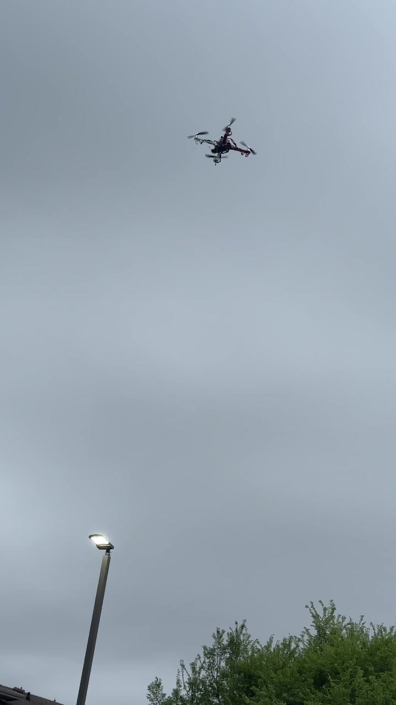</td>
</tr>
<tr>
<td><b>GPS position hold, daylight.</b> Holding a point in 15 to 20 mph wind, above the court used for all outdoor testing.</td>
<td><b>Altitude hold at height.</b> The same airframe after the fault was cleared.</td>
</tr>
<tr>
<td></td>
<td>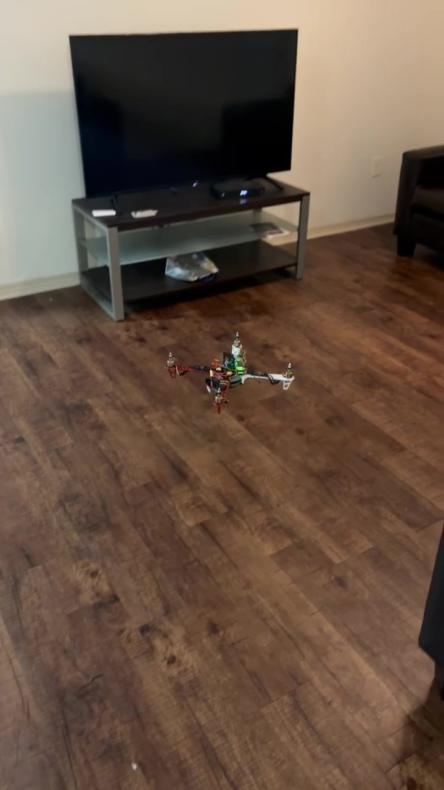</td>
</tr>
<tr>
<td><b>Position hold after dark.</b> Navigation LEDs as the only visual reference for drift.</td>
<td><b>Indoor angle-mode check.</b> The first flight after re-seating the bell on motor 2.</td>
</tr>
</table>

| Test | Outcome |
|---|---|
| Bench arm and disarm, no propellers | Pass. Correct directions on all four. |
| Indoor hover, angle mode | Pass. Responsive to stick input. |
| Outdoor angle mode, light wind | Pass. Manual position correction expected and required. |
| Outdoor altitude hold | Pass. Vertical drift under 1 m over 60 s. |
| Outdoor GPS position hold, 15 to 20 mph wind | Pass. Lateral drift bounded to roughly 1 to 2 m. |
| Return-to-home on aux switch | Pass. Climbs, navigates, descends, disarms. |
| Autonomous waypoint mission | Not attempted. Regulatory, not technical. See [`docs/regulatory.md`](docs/regulatory.md). |

**On the 1 to 2 m hold figure.** With 8 satellites and an HDOP of 1.8, absolute position accuracy is roughly HDOP times the user-equivalent range error, which for single-frequency GNSS is 3 to 5 m, giving a 1σ absolute error of 5 to 9 m. The observed hold is far tighter than that, and the reason is that position *hold* is a relative problem. The GNSS bias drifts slowly and is common-mode over the minutes a hold lasts, so the estimator only has to reject short-term noise, which is a much smaller quantity. Quoting a hold figure as though it were absolute accuracy is a common error and this one is not that.

---

## Roadmap

Ordered by value, which is not the order they are fun in.

| # | Item | Why |
|---|---|---|
| 1 | **Confirm the motor output protocol; move to DSHOT600** | Finding 1. Potentially the single largest available improvement in handling, and it costs nothing but a configuration change |
| 2 | **Enable blackbox logging** | Turns the next fault from a four-hypothesis elimination into a spectrum plot. Video established *what* the airframe did; logging would have shown *which arm* did it |
| 3 | **Weigh the vehicle** | The all-up weight estimate propagates into thrust-to-weight, endurance and the fault model. Five seconds of work |
| 4 | Verify the ESC BEC wiring | Finding 2. Paralleled BECs are a latent thermal problem |
| 5 | Telemetry downlink, 915 MHz MAVLink | Real-time state monitoring, and a way to cross-check INAV's estimator against logged sensor data |
| 6 | Autonomous waypoint missions in compliant airspace | Blocked on relocation to Oregon, not on capability |
| 7 | Custom four-layer power distribution board in KiCad | Current sense on the main bus, integrated regulators, proper plane geometry. The point of interest is measuring BLDC commutation noise coupling into adjacent sensor lines, which a closed commercial PDB does not expose |

---

## Verification

Every figure in this document is a prediction. Priority order for turning them into data:

1. **Weigh the vehicle.** A kitchen scale. Fixes the input that propagates furthest.
2. **Read the CLI dump for the motor protocol.** Free, and it decides whether finding 1 is a live defect or a documentation error.
3. **Enable blackbox logging.** Gives per-motor vibration spectra, PID activity and the actual attitude-loop behaviour.
4. **Thrust stand.** A kitchen scale and a jig will do. Gives real thrust against throttle and validates the whole propulsion model.
5. **Inline wattmeter.** Real hover current, which resolves the 13 to 16 minute endurance band into one number.

Full procedures: [`docs/verification.md`](docs/verification.md)

---

## Acknowledgements

Component selection and the general approach follow **Hoarder Sam's** video [*I Built a $150 Autonomous Drone (Step by Step)*](https://www.youtube.com/watch?v=uC9hVyqGvDE), which demonstrated that a capable autonomous quadcopter could be assembled on a student budget. The bill of materials is substantially his. The bring-up methodology, the validation firmware, the fault investigation and the analysis in this repository are this project's own contribution.

Thanks also to the maintainers of [INAV](https://github.com/iNavFlight/inav) for firmware that exposes its internals well enough to learn from.

---

## Safety and regulatory notice

This vehicle carries 1.2 kg of mass on four unguarded propellers turning at over 7000 rpm. It is flown line-of-sight, in open areas, away from people. Autonomous waypoint missions are deliberately not enabled; the reasoning is in [`docs/regulatory.md`](docs/regulatory.md).

This repository documents one build. It is not a construction guide, and nothing in it has been reviewed for airworthiness.

---

## Author

**Nguyễn Minh Khôi**
Oregon State University · [github.com/minhkhoinguyen206-netizen](https://github.com/minhkhoinguyen206-netizen)

## License

MIT, see [`LICENSE`](LICENSE). Photographs are © Nguyễn Minh Khôi.
