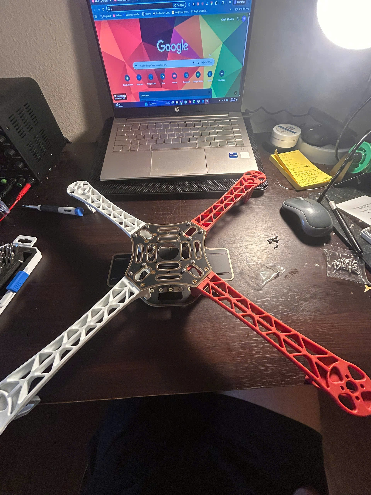
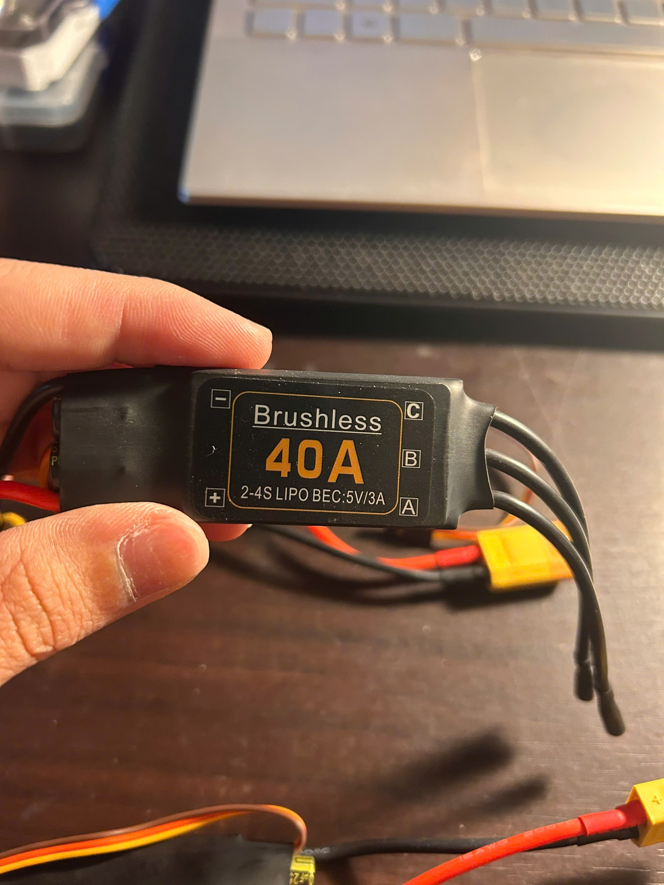
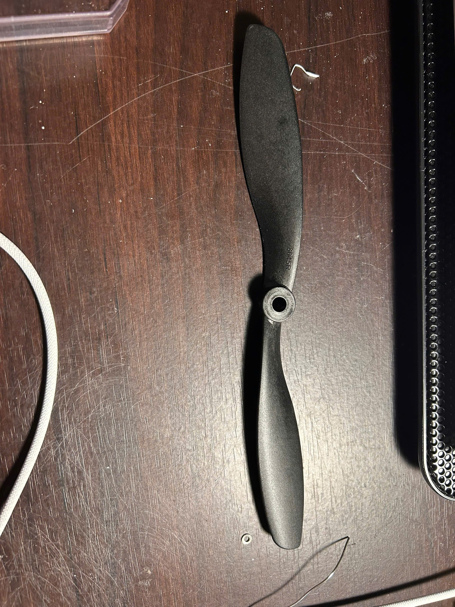
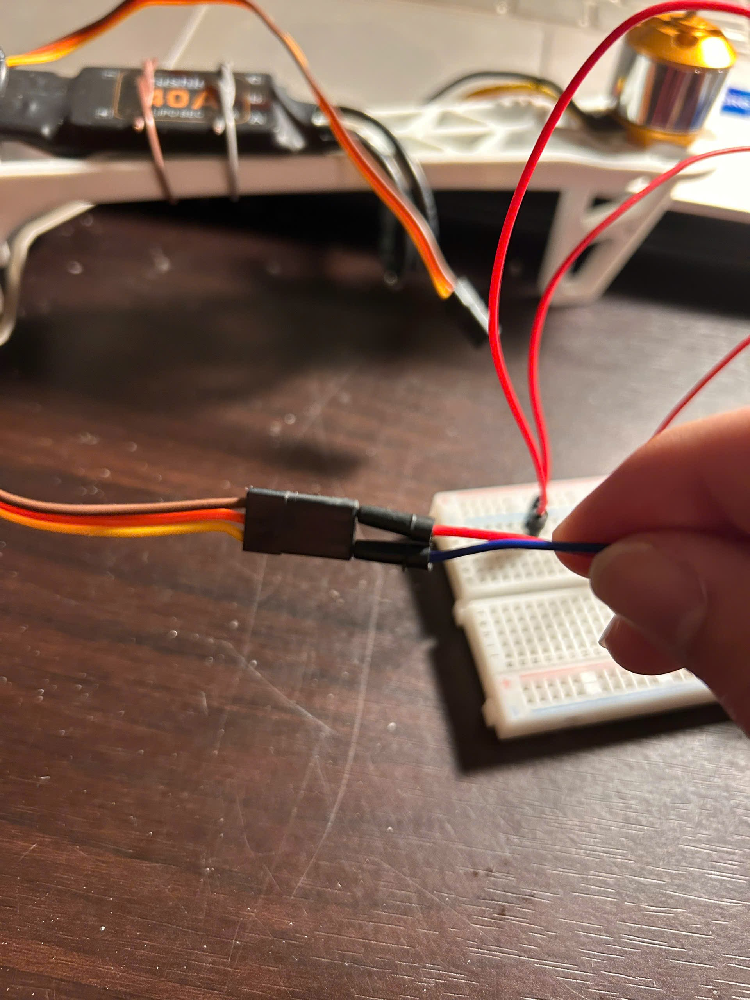
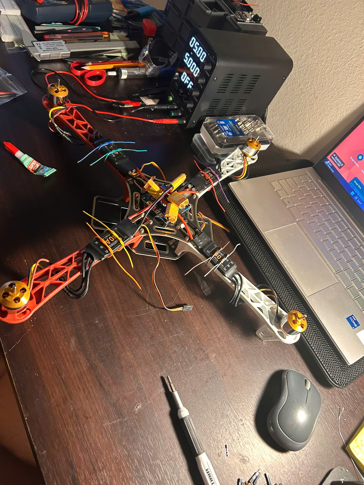
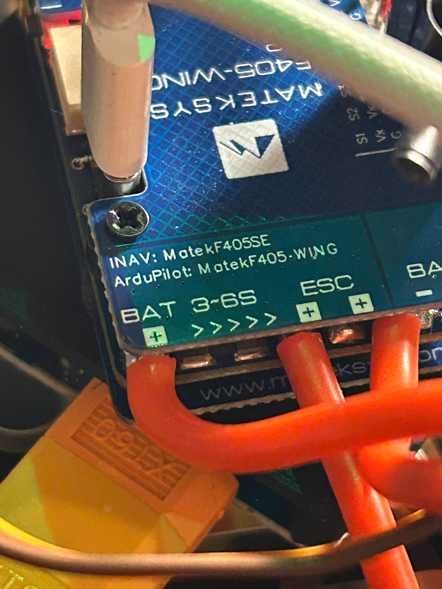
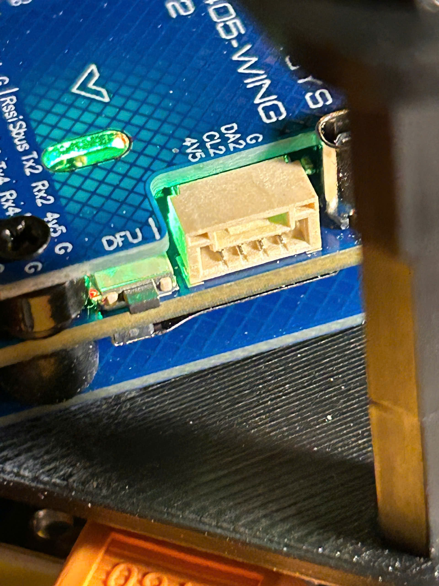
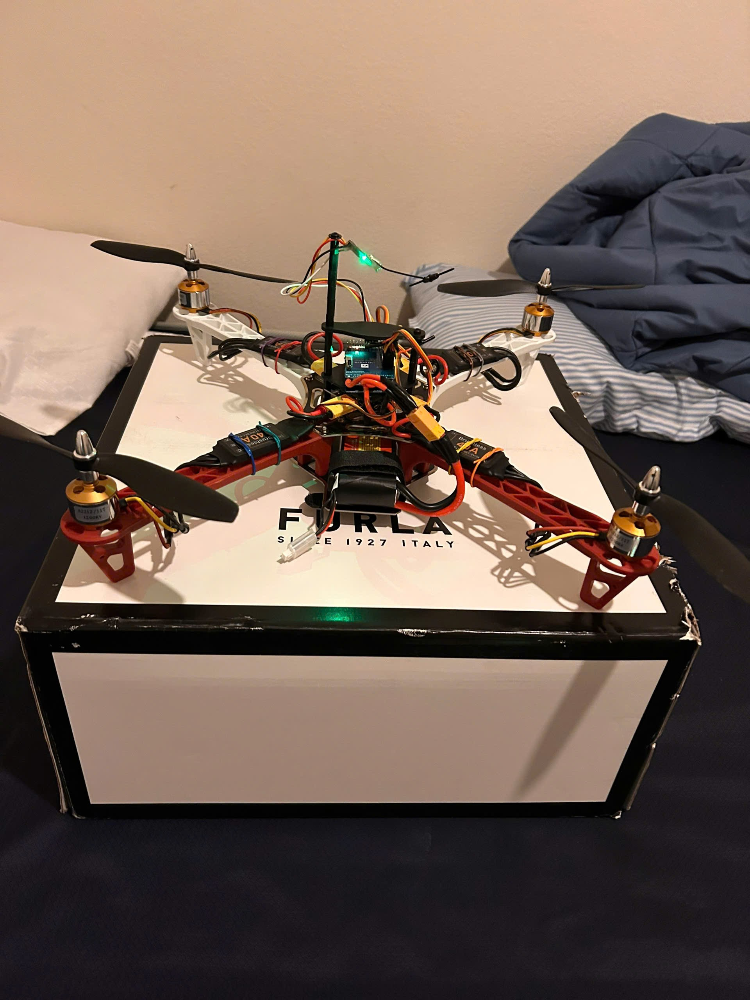
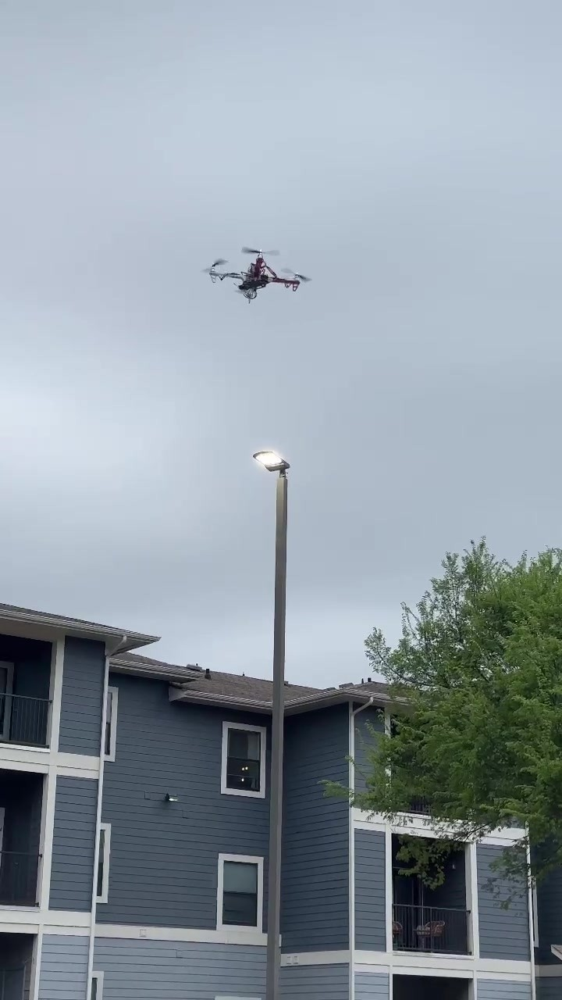

# Bring-up

Four phases, February to March 2026. Each produced a subsystem that was demonstrably correct before the next added complexity on top of it.

This is slower than wiring the vehicle together and turning it on. The payoff is that every fault appearing after phase 1 is an integration fault, because the components were already known good. When the vehicle later developed a repeatable roll divergence, that guarantee is what made a four-hypothesis elimination tractable instead of an open-ended parts swap.

---

## Phase 0: parts

<table>
<tr><td width="50%"></td>
<td width="50%"></td></tr>
<tr>
<td>F450 V1 frame kit, 450 mm motor to motor, with the power distribution board integrated into the lower plate. The arms are the reason the roll inertia is 82 % arm-tip mass.</td>
<td>A2212/11T, 1200 KV. Rated 12 A continuous, which turns out to be the binding constraint on the whole vehicle: see <a href="calculations.md#3-thrust-margin">calculations §3</a>.</td>
</tr>
<tr><td></td>
<td></td></tr>
<tr>
<td>40 A ESC, 2-4S, 5 V / 3 A BEC. Three times the motor's rating, which means it can never protect it. Also four BECs feeding a flight controller that has its own regulators, which needs a continuity check.</td>
<td>8 x 4.5 fixed pitch. Blade Reynolds number at hover is about 70 000, deep enough into the low-Reynolds regime to justify a figure of merit of 0.50.</td>
</tr>
</table>

---

## Phase 1: ESC and motor characterisation

Before the flight controller arrived, each ESC and motor pair was driven directly from an Arduino UNO with a B10K linear potentiometer as the throttle source. The wiper voltage was read on A0, mapped to the ESC's 1000 to 2000 µs pulse range, and emitted on D9 through the Servo library.

The arming sequence, hold minimum throttle for two seconds, was written out explicitly rather than relied upon. An ESC that is not armed and an ESC that is armed but receiving minimum throttle look identical from the outside, and telling them apart later costs more than being explicit up front.

Sketch: [`firmware/esc_motor_test/esc_motor_test.ino`](../firmware/esc_motor_test/esc_motor_test.ino)

<table>
<tr><td width="50%"></td>
<td width="50%"></td></tr>
<tr>
<td>B10K potentiometer feeding the Arduino ADC. Throttle in software, not in a transmitter, so the input is known exactly.</td>
<td>ESC signal line brought out to the breadboard so the pulse train could be observed cleanly.</td>
</tr>
</table>

This phase confirmed three things that would have been difficult to separate later:

1. The pack could supply the inrush the ESCs draw at power-up.
2. The arming sequence was actually being satisfied by the throttle source.
3. Each motor responded smoothly across the throttle range with no dropouts.

All four pairs were verified before any of them went on the frame.



---

## Phase 2: flight controller integration

With the power chain and motor drive proven, the MATEK F405-WING V2 was installed and flashed with INAV 9.0.1, target `MATEKF405SE`.

<table>
<tr><td width="50%"></td>
<td width="50%"></td></tr>
<tr>
<td>STM32F405RGT6 at 168 MHz with hardware floating point, enough flash for the full INAV image with navigation features enabled, and six UARTs so that ELRS, GNSS, telemetry and configuration can coexist without bit-banging anything.</td>
<td>The board silkscreen carries both the INAV and ArduPilot target names, which leaves a firmware migration path open if INAV's autonomous features become limiting.</td>
</tr>
</table>

Initial configuration over USB MSP:

- Mixer set to **Quadcopter X**, motors mapped to the first four PWM outputs.
- Battery monitor configured for 3S, the voltage divider calibrated against a separate multimeter reading to within 0.05 V.
- ELRS receiver on UART1, protocol **CRSF**, 115200 baud.
- Default PID values kept. Tuning was deferred until a stable hover existed to tune against, because tuning against an unstable vehicle teaches you about the instability rather than about the gains.

The first integrated flight in angle mode was successful: the vehicle hovered, responded to stick input, and landed. No GPS features were enabled at this point.


---

## Phase 3: GNSS and compass

The M100-5883 was wired to the FC's I2C port and UART3. INAV reported the GNSS receiver correctly and **failed to detect a compass.** This was the first genuine integration problem of the build.

<table>
<tr><td width="50%"></td>
<td width="50%"></td></tr>
<tr>
<td>HGLRC M100-5883: u-blox M10 GNSS and a magnetometer on one board, mounted on a mast away from the power wiring.</td>
<td>The harness. Six conductors: SCL, SDA, RX, TX, 5 V, GND.</td>
</tr>
</table>

The cheap move would have been to assume a dead module and order another. Instead the bus itself was checked: an Arduino UNO ran a scanner sketch with its SDA and SCL tied to the same physical lines.

Sketch: [`firmware/i2c_scanner/i2c_scanner.ino`](../firmware/i2c_scanner/i2c_scanner.ino)

```
Scanning...
Found I2C device at 0x0D
Scan done, 1 device(s).
```

The magnetometer was alive and answering at `0x0D`, which is the **QMC5883L** and not the **HMC5883L** at `0x1E` that the "5883" in the module's name suggests. Setting the magnetometer type explicitly fixed detection on the next reboot.

Thirty seconds of scanning replaced a week of shipping and a replacement part that would have behaved identically.

**This has its own write-up:** [`i2c-debug.md`](i2c-debug.md) covers why two chips share a number, what the scan did and did not prove, the bus timing and rise-time analysis that rules out the alternative explanations, and the general decision tree for a peripheral that will not enumerate.



### Compass calibration

INAV's routine requires rotating the airframe through 360 degrees on each of three axes while the magnetometer logs per-axis minima and maxima to compute the hard-iron offset. The procedure was run three times, and the final heading cross-referenced against a handheld compass before being accepted.

Calibration quality is the single largest variable in GPS-mode stability. A poor calibration makes the vehicle fight its own heading estimate during position hold and drift in slow circles, which is a failure mode that looks like a tuning problem and is not.

The receiver locks 8 satellites at HDOP 1.8 in typical outdoor conditions, tracking GPS, Galileo and BeiDou concurrently on the M10 chip. What that HDOP figure does and does not imply about hold accuracy is worked through in [`calculations.md §10`](calculations.md#10-gnss-position-accuracy).

---

## Phase 4: flight validation

Automation was added one layer at a time, each confirmed before the next was enabled.

<table>
<tr><td width="50%"></td>
<td width="50%"></td></tr>
<tr>
<td>Bench arm and disarm with no propellers fitted, confirming direction and mix.</td>
<td>First indoor hover in angle mode.</td>
</tr>
</table>

1. **Angle mode.** Stick response, trim, and that the airframe sat level at hover.
2. **Altitude hold.** Confirmed the SPL06 barometer was giving useful vertical feedback.
3. **GPS position hold.** Outdoor, in 15 to 20 mph wind, holding altitude and lateral position to roughly 1 to 2 m for several minutes under continuous wind loading.
4. **Return to home.** Commanded on an aux switch. Climbs to the preset safe altitude, navigates to the arming position, descends, disarms.

The hold accuracy and the successful RTH together validate the whole chain at once: compass calibration, GNSS lock quality, INAV's position estimator, and the lateral PID tuning. Any one of them being wrong shows up here.

<table>
<tr><td width="50%"></td>
<td width="50%"></td></tr>
<tr>
<td>GPS position hold in daylight.</td>
<td>The same test after dark, with navigation LEDs as the only visual drift reference.</td>
</tr>
</table>

---

## Between phase 3 and phase 4

The account above is tidier than the reality. Between the GNSS bring-up and a working phase 4 result, the vehicle developed a repeatable roll divergence at throttle-up that took four hypotheses to isolate and several crashes to survive. That investigation has its own document: [`fault-analysis.md`](fault-analysis.md).

<table>
<tr><td width="50%"></td>
<td width="50%"></td></tr>
<tr>
<td>Measuring rotor speed with reflective tape and an optical tachometer. This test cleared all four motors and was wrong.</td>
<td>The rotor of motor 2 lifted clear of its stator during teardown. This was the answer.</td>
</tr>
</table>

The crashes during that period also destroyed the original antenna mast twice, which is what drove the V2 hardware revision described in [`design-notes.md`](design-notes.md).
