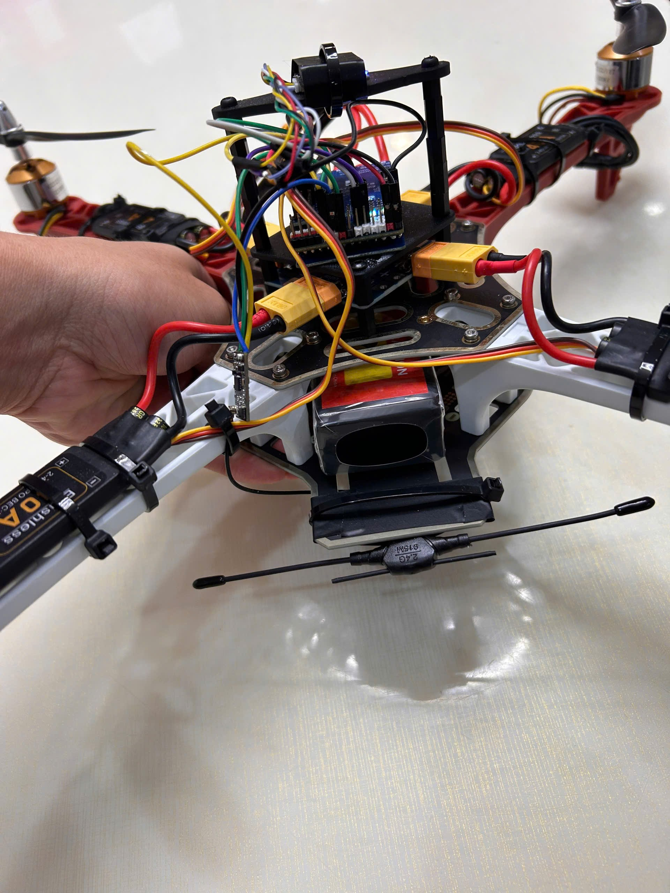
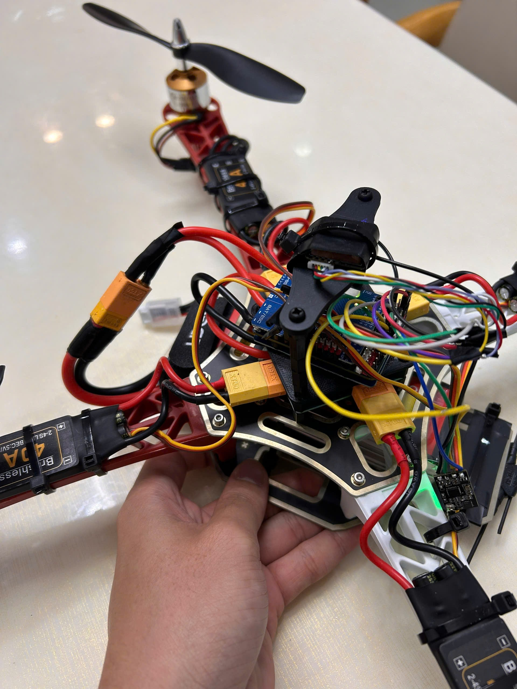
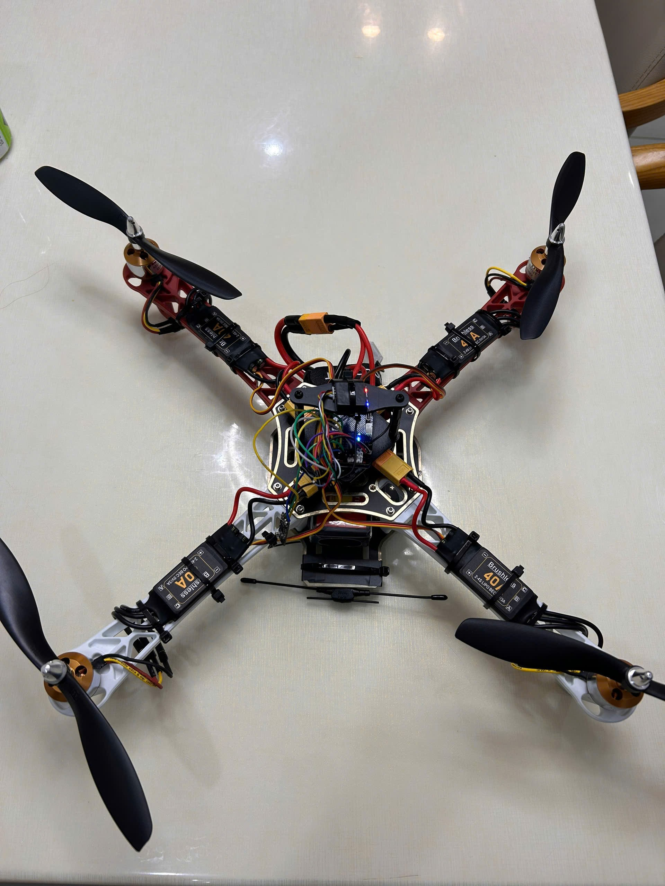

# Design notes

Why each part was chosen, and what the two hardware revisions were responding to.

---

## What the vehicle is for

A platform for learning the embedded flight-control stack from the bottom: sensor bring-up, bus debugging, actuator characterisation, closed-loop navigation, and the failure modes that appear when all of those are wired together. Not a camera platform, not a racer.

That goal shaped one decision more than any other: **every subsystem was validated independently before integration**, even where that was slower. The value is not that it prevents faults. It is that when a fault appears later, the set of things it can be is small.

---

## Flight controller: MATEK F405-WING V2

| Requirement | Why this board meets it |
|---|---|
| Hardware floating point | STM32F405RGT6 at 168 MHz with an FPU. INAV's navigation code is float-heavy and an M4 without an FPU is noticeably tighter |
| Flash for the full image | The navigation feature set does not fit on smaller targets |
| Enough UARTs | Six, so ELRS, GNSS, telemetry and configuration coexist without bit-banged peripherals |
| Onboard sensors | ICM42605 6-axis IMU, SPL06 barometer |
| A second firmware option | The board is supported by both INAV and ArduPilot, which keeps a migration path open |

The name is the one thing to be careful about. "WING" is a fixed-wing designation, and the board's defaults come from that world. Standard 50 Hz PWM is the correct output rate for a servo and the wrong one for a multirotor motor, which is the subject of [finding 1](../README.md#finding-1-the-motor-output-protocol-may-be-eating-the-entire-phase-margin). Inheriting a default is not the same as choosing it.

---

## Why the compass is external

The magnetometer sits on the GNSS mast rather than on the flight controller, and this is not incidental.

Each arm carries 10 to 15 A of commutation current under load, switching at the ESC's PWM frequency. The magnetic field from a current-carrying conductor falls off roughly as the cube of distance for a compact loop. Moving the magnetometer 150 mm away from the power wiring is worth something like two orders of magnitude in interference.

Heading error is what makes a GPS-mode vehicle drift in slow circles during position hold, because the estimator's idea of which way is north is rotating with throttle. It looks exactly like a tuning problem and no amount of tuning fixes it. An onboard magnetometer sitting between four ESCs is one of the more common reasons a hobbyist build holds position badly.

---

## Motor and propeller pairing

A2212/11T at 1200 KV with 8 x 4.5 propellers on 3S.

The pairing matters more than either part individually. KV sets rotor speed per volt; propeller diameter and pitch set how much torque that speed demands. Get the combination wrong and the motor either loafs, or sits at its thermal limit in the hover.

| Combination | Behaviour |
|---|---|
| 1000 KV with 10 x 4.5 | The conventional F450 pairing. Larger disc, lower speed, better hover efficiency |
| **1200 KV with 8 x 4.5** | **Fitted here.** Smaller disc, higher speed, slightly worse hover efficiency, more thrust headroom |
| 1200 KV with 10 x 4.5 | Larger disc at high KV. Current rises and the motor runs near its thermal ceiling |

[`calculations.md §6`](calculations.md#6-propeller-trade-study) puts numbers to it: a 10 inch blade would buy about 20 % more endurance because induced power scales as one over the square root of disc area. The catch is that the A2212 is rated 12 A continuous and is already the binding constraint. **Changing the propeller alone would trade a thrust-margin problem for a thermal one**, which is not an improvement.

---

## What the ESC choice got wrong

40 A ESCs on a 12 A motor. Chosen for headroom, which sounds prudent and is the wrong instinct here.

An ESC's current limit is a protective device. Sized at three times the motor's rating, it will never operate: a fouled propeller, a dragging bearing or a bound bell takes the winding to its thermal limit while the ESC reports 30 % of its own rating and reports nothing wrong. **The protection exists, is correctly rated for itself, and protects nothing downstream.**

The 40 A parts also carry about 30 g more than correctly sized 20 A units, on a vehicle whose thrust-to-weight ratio is the binding constraint. It is not enough to matter on its own; it is a reminder that headroom is never free.

There is a second issue in the same area. Each ESC carries a 5 V / 3 A BEC, and the flight controller has its own regulators. If more than one BEC output reaches the FC's 5 V rail they are in parallel, and the one with the highest output voltage carries the whole load while the others idle into their own regulation loops. Standard practice is to remove the red conductor from three of the four servo leads, or all four. This needs a continuity check rather than an assumption.

---

## Revision V2

Two changes, both driven by crash data accumulated during early tuning, which is to say by the period documented in [`fault-analysis.md`](fault-analysis.md).

### Antenna relocation

The original ELRS antennas were on a vertical mast above the flight controller. Excellent omnidirectional geometry, and the first thing to break in any crash. After two replacements, both antennas were moved to the underside of the frame, angled to keep some polarisation diversity.

The first version of this write-up described the RF cost as "measurable but tolerable" and left it there. That is an assertion, not an engineering conclusion. [`calculations.md §9`](calculations.md#9-control-link-budget) replaces it:

| Antenna scenario | Range at a 10 dB fade margin |
|---|---|
| Mast, clear line of sight (V1) | 15.1 km |
| Underside, favourable attitude (V2) | 7.6 km |
| Underside, airframe in the path (V2) | 2.7 km |
| Underside, deep null (V2, worst case) | 849 m |

The relocation costs between half and 94 % of theoretical range depending on attitude. It sounds severe. It does not matter, because every flight in this project has been line-of-sight inside a few hundred metres, where even the worst-case null holds 29 dB of margin.

**The relocation spends margin the vehicle was never using.** That is the difference between a good engineering trade and a convenient one, and it is a distinction that cannot be made without doing the arithmetic. The original decision was made on the correct instinct; the analysis is what turns instinct into a defensible choice.

<table>
<tr><td width="50%"></td>
<td width="50%"></td></tr>
<tr>
<td>V2 antenna position, laid against the frame underside.</td>
<td>V2 cabling. Loose wire near the propeller arc was the second most common crash-time failure after antenna damage.</td>
</tr>
</table>

### Cable management

Zip ties and adhesive-backed mounts, keeping the power leads and signal harness against the arms. Unglamorous, and it removed the second most common failure mode.

---

## Trade-offs accepted, stated plainly

| Decision | What it buys | What it costs |
|---|---|---|
| 5000 mAh pack | 13 to 16 minutes of hover | 380 g, 32 % of all-up weight, and most of the thrust-to-weight problem |
| 40 A ESCs | Headroom that is never used | No motor protection, about 30 g |
| 8 inch propellers with 1200 KV | Thrust headroom, motor within its thermal rating | About 20 % more hover power than a 10 inch disc would need |
| Antennas underside | Survives crashes | Half to 94 % of theoretical range, none of which was in use |
| External compass on a mast | Two orders of magnitude less magnetic interference | A mast that breaks, and 18 g |
| No blackbox logging | Nothing | Four hypotheses instead of one spectrum plot |

The last row is the only one that was not a decision. It was an omission, and it is item 2 on the roadmap.
