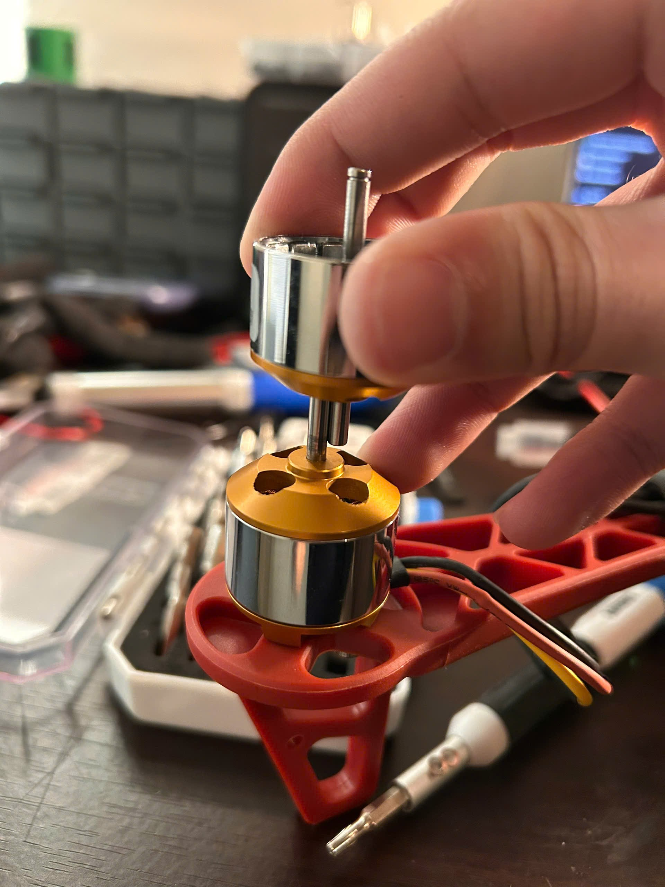
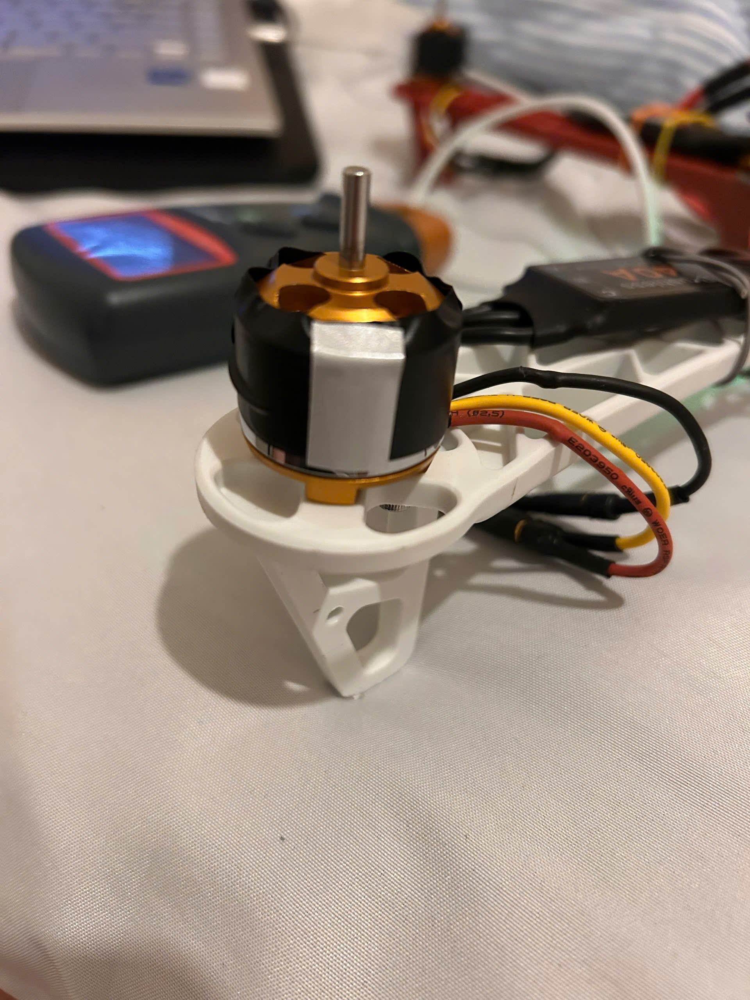
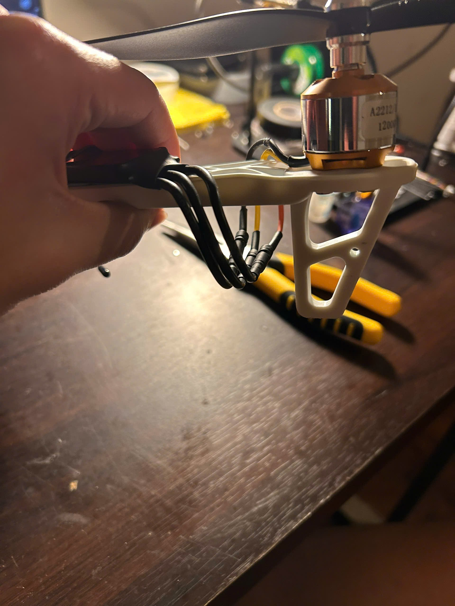
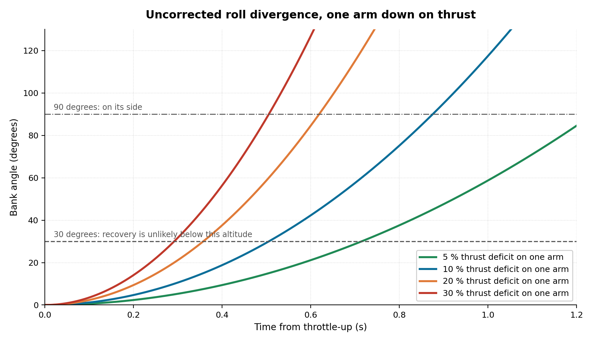

# Fault investigation: roll divergence at throttle-up

The most useful content in this repository, and the least flattering.

---

## The observable

Between phase 3 and a successful phase 4, the vehicle developed a repeatable failure:

- Arming succeeded normally. No warning flags in the configurator, no failsafe.
- The moment throttle was applied, the airframe rolled and tipped onto one side.
- Time from throttle-up to on-its-side was roughly one second.
- It repeated across multiple test flights, on multiple battery charges, in both indoor and outdoor conditions.

Nothing in the telemetry available at the time said anything was wrong, because there was no telemetry available at the time. The vehicle has no blackbox logging. That is itself one of the conclusions.

<p align="center"></p>

<p align="center"><i>Motor 2 during teardown. The rotor, meaning the bell with its magnets and the shaft, lifts clear of the stator that stays on the mount. This joint is what was not rigid.</i></p>

---

## Video evidence

Six takeoff attempts were filmed on a phone at 30 fps. Stepping through them frame by frame settles two things the written account could not.

<p align="center"></p>

<p align="center"><i>One attempt at 30 fps, brightened for legibility. Time is measured from the frame in which the airframe first leaves the surface.</i></p>

**The failure is a roll, not a yaw.** The airframe banks about its longitudinal axis and goes over sideways. It does not rotate about the vertical axis. A separate clip, in which the aircraft sits at partial throttle on the ground for seven seconds before an attempt, shows it holding a fixed heading throughout: the red arms stay on the same side of frame from t = 1 s to t = 7.5 s. A continuous yaw torque imbalance would have appeared there and did not.

The distinction decides where to look. Yaw would implicate motor direction or reaction-torque balance. Roll implicates thrust asymmetry across one axis, which is where hypothesis 4 eventually landed.

**Timeline read off the frames:**

| Time from lift | Approximate bank | State |
|---|---|---|
| 0.00 s | 0° | Level, all four legs on the surface |
| +0.10 s | ~5° | Off the surface, still near level |
| +0.17 s | ~15° | Bank clearly developing |
| +0.23 s | ~25° | Committed |
| +0.30 s | ~45° | Not recoverable |
| +0.37 s | ~75° | On its side |

The other clips repeat the behaviour. In one the aircraft never gains height at all: it leans and skitters sideways across the court for several seconds, which is the same roll moment resolved against the ground instead of in the air.

## Method

The temptation with a failure like this is part substitution: swap the battery, then the ESC, then the motor, until something changes. That finds the answer eventually and teaches nothing, because at the end you know which part fixed it and not why.

Instead, hypotheses were enumerated first and then **ordered by test cost, cheapest first**, so that a cheap answer would make the expensive tests unnecessary.

| # | Hypothesis | Cost to test | Result |
|---|---|---|---|
| 1 | Battery cell imbalance | Free. Reconfigure the battery profile, re-fly | Tipped identically. **Eliminated** |
| 2 | Motor spin direction mismatch | Minutes. INAV motor test page plus visual check | All four matched the X-config diagram. **Eliminated** |
| 3 | RPM mismatch between motors | Half an hour. Props off, optical tachometer at 50 % throttle | All four at approximately 11 300 rpm. **Eliminated** |
| 4 | Mechanical play in a motor | Hand inspection of each motor | Motor 2 had visible axial play. **Root cause** |

Hypothesis 1 was tested first not because it was likely but because it was free.

### The test that produced the misleading answer

<p align="center"></p>

<p align="center"><i>Hypothesis 3 in progress. Alternating reflective and matt segments taped around the bell give the optical tachometer, on the bench at left, a once-per-revolution edge to count. Propellers off, ESC connected, throttle commanded from the flight controller.</i></p>

The rig is sound and the measurement it produced was correct: all four motors turned at approximately 11 300 rpm and the readings agreed with one another. The conclusion drawn from it, that the motors were healthy, was wrong.

Everything visible in that photograph is on the electrical side of the shaft. The tape reads rotation. The tachometer counts edges. Neither of them can see the joint that had failed, which is inside the bell and only loads up when a propeller is pulling on it. **The propellers are off in this photo, which is correct for safety and is exactly what makes the test blind to the fault.**

---

## Root cause

The bell on motor 2 was not rigidly coupled to its shaft. The retaining clip had loosened during earlier crash impacts, most probably during the same sequence of tuning crashes that destroyed the original antenna mast.

At idle the play was small enough to be invisible. Under thrust load it was not: the rotor could move relative to the shaft that was driving it.

The fix was to disassemble the motor, re-seat the bell, verify zero play by hand, and re-test. Subsequent flights were stable.



---

## What the numbers say

Narrative is not evidence. Three questions are worth putting arithmetic to, and the arithmetic is in [`calculations.md §8`](calculations.md#8-roll-divergence-from-a-single-arm-thrust-deficit).

### Does a thrust deficit reproduce the observed timescale?

Roll inertia, built up from the mass budget rather than guessed as a lump, is 0.01142 kg·m². Eighty-two per cent of it is the four arm-tip masses at a 159 mm moment arm, which is what you would expect on an airframe whose heavy items are all at the ends of the arms.

A thrust deficit of fraction δ on one arm gives an uncorrected angular acceleration of δ·T·r / I:

| Deficit on one arm | Angular acceleration | Time to 30° | Time to 90° |
|---|---|---|---|
| 5 % | 117 °/s² | 0.71 s | 1.24 s |
| 10 % | 235 °/s² | 0.51 s | 0.87 s |
| 20 % | 470 °/s² | 0.36 s | 0.62 s |
| 30 % | 705 °/s² | 0.29 s | 0.51 s |

The written account recorded the tip-over as taking "roughly a second". The video corrects that: **0.25 s to 30° and about 0.4 s to 90°**, which is faster than any row in the table.

Reading the deficit back out of the measurement, using the fact that time to a given angle scales as one over the square root of the deficit:

```
δ ≈ 0.30 × (0.29 / 0.25)²  ≈ 0.40      from the 30° crossing
δ ≈ 0.30 × (0.51 / 0.40)²  ≈ 0.49      from the 90° crossing
```

One correction applies before believing 40 to 50 %. A takeoff attempt commands more than hover thrust, and the disturbing moment scales with the thrust actually being produced, not with hover thrust. At roughly 1.3 times hover throttle a **30 %** deficit gives 0.26 s to 30°, which matches the measurement almost exactly.

**Either reading puts the deficit at or beyond the severe end of the modelled range.** Motor 2 was not slightly weak. It was losing something close to a third of its thrust, and possibly more.

The measurement carries real uncertainty: handheld camera, perspective foreshortening, and an airframe that is partly ground-supported for the first few frames. It is still a far better constraint than "roughly a second", and it came from footage that already existed.



### Why did the tachometer say everything was fine?

This is the part worth carrying forward to other projects.

Unloaded rotor speed is set by the applied voltage and the back-EMF constant. It is almost independent of anything downstream of the shaft. Thrust is set by something else entirely: what the propeller disc does with that rotation, whether it stays perpendicular to the shaft, whether it stays in one plane, whether the bell is rigidly coupled to what is driving it.

The measured 11 300 rpm implies 9.42 V of back-EMF. That is a statement about the motor's electrical behaviour and it is accurate. It is also completely silent on the mechanical question that mattered.

There is a second reason the test could not have worked, visible in the photograph above: **the propellers were off.** They have to be, for safety, on a motor spinning next to your hands. But a bell with angular freedom only tilts when something is pulling on it, and with no propeller there is no thrust load and therefore no tilt. The fault was not merely invisible to the instrument. It was not present during the test.

**A no-load tachometer measures the electrical half of the drivetrain and is blind to the mechanical half.** Motor 2 passed the test it was given. The test was the wrong test.

The generalisable form: instruments measure the thing they measure, not the thing you care about. When a system fails in a way the instrumentation says is impossible, the next hypothesis to test should be in whatever domain the instrumentation does not cover.

### Why did the integrator not simply trim it out?

A constant thrust deficit on one arm is precisely what an integral term exists to absorb. Within a second or two of hover the roll integrator would have wound up, commanded more thrust on the weak arm, and the vehicle would have flown level with a slightly asymmetric motor mix. Plenty of multirotors fly for years with a mismatch like that and nobody notices.

That it did not happen tells us something the hand inspection alone did not: **the deficit grew with commanded thrust.** More thrust means more aerodynamic load on the rotor, which means a bell with angular freedom tilts further, which means a larger share of the thrust goes somewhere other than up. Commanding more thrust to the weak arm bought less than the controller expected it to.

That is not a disturbance. It is a **loss of control effectiveness**, and the two behave completely differently: a disturbance is what the integrator is for, while reduced effectiveness makes the loop gain wrong, and no amount of integral gain recovers from it.

This distinction is the single most useful thing the failure produced, and it was not visible from the hand inspection. It only appears once you ask why the controller failed to compensate.

---

## What would have found it in five minutes

A bell with angular play forces the airframe at rotor frequency. At the 7177 rpm hover point that is 119.6 Hz, with a 239 Hz blade-pass component on a two-blade prop.

INAV's default gyro low-pass sits at 90 Hz. A 120 Hz forcing therefore lands just above the corner, where it is attenuated but not removed, and it feeds into the accelerometer that anchors the whole attitude estimate.

With blackbox logging fitted, a per-motor vibration spectrum would have shown one arm carrying a peak the other three did not, and the diagnosis would have taken one flight instead of four hypotheses and several crashes.

**Fitting logging is item 2 on the roadmap for exactly this reason.** The cost of not having instrumentation is not that you cannot debug; it is that debugging costs four hypotheses instead of one plot.

---

## Related: the actuator bandwidth question

A separate issue surfaced by the modelling in [`calculations.md §7`](calculations.md#7-actuator-bandwidth), and worth reading next to this one because the two interact.

If the motor output protocol is standard 50 Hz PWM, the actuator contributes 79 degrees of phase lag at a 20 Hz rate-loop crossover, which is more than the entire phase margin a stable loop has to spend. A control loop that slow has correspondingly less ability to reject **any** disturbance, including a thrust asymmetry.

The fault above would have been a serious problem on any configuration. But a loop with adequate bandwidth would have fought it harder and for longer, and the difference between "tips over in one second" and "wobbles alarmingly but stays up" is exactly the kind of margin that actuator latency buys or spends.

Reading `motor_pwm_protocol` out of the CLI dump is free and is item 1 on the roadmap.

---

## Lessons, stated plainly

1. **Film the failure.** Six clips existed the whole time. Stepping through them at 30 fps resolved the axis of the divergence and put a number on its timescale, both of which had been recorded as impressions. Video is the cheapest instrumentation on any project and it is usually already there.
2. **Order hypotheses by test cost, not by likelihood.** Three cheap eliminations cost less than one expensive one, and they narrow the field just as effectively.
3. **Instruments measure what they measure.** A tachometer confirms rotational health, not thrust health. Know which half of a system your instrument sees.
4. **A safe test can be the wrong test.** Removing the propellers was correct and it also removed the load that made the fault appear. When a bench test clears a component that later fails in service, ask what the bench was not applying.
5. **How a controller fails is evidence.** That the integrator could not absorb the fault identified the mechanism more precisely than the physical inspection did.
6. **Instrumentation is not overhead.** The cost of no logging was not being unable to debug. It was four hypotheses instead of one spectrum plot.
7. **Crash damage propagates.** The loose bell almost certainly came from the same impacts that broke the antenna mast. After any crash, inspect everything mechanical, not just what visibly broke.
