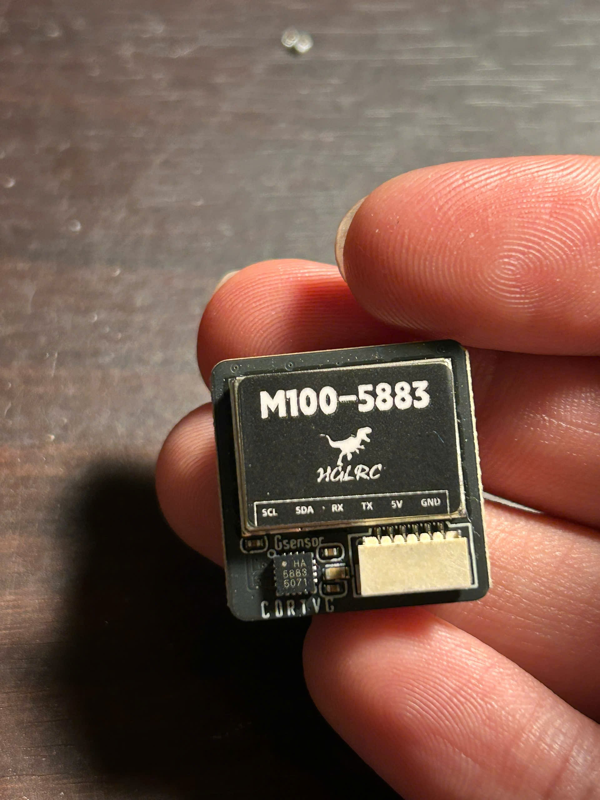
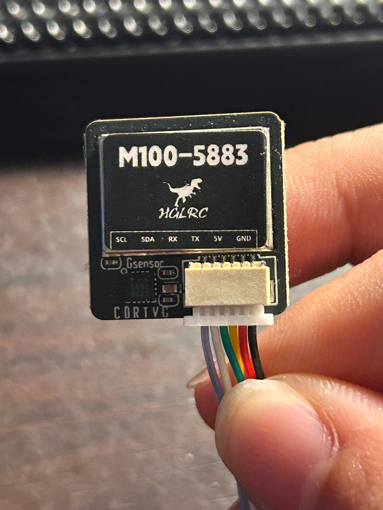
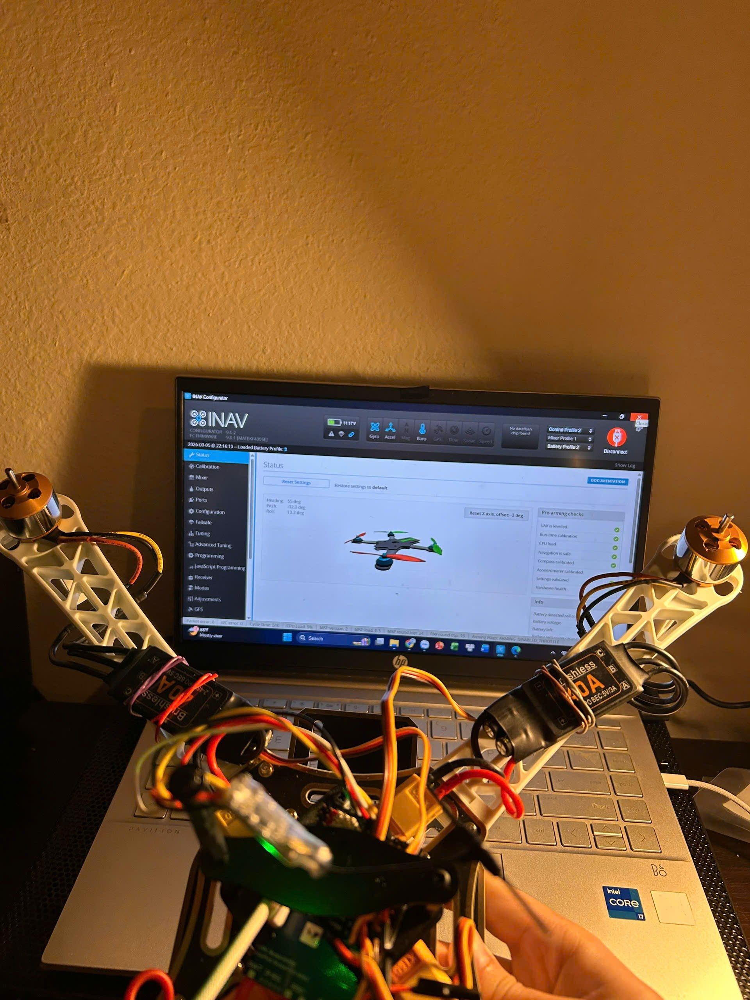

# I2C debugging: the magnetometer that was there all along

A device on a bus reported as absent, found present, and the reason the two statements were both true.

This is the least dramatic problem in the build and probably the most transferable. A wobbling motor bell is a drone problem. A peripheral that does not enumerate is something that happens on every embedded project anyone will ever work on.

---

## Symptom

The M100-5883 module was wired to the flight controller's I2C port and to UART3. On the first boot after wiring:

- INAV detected the **GNSS receiver** correctly and began reporting satellites.
- INAV reported **no magnetometer**.

Both halves of the module are on the same physical board, fed by the same connector, from the same regulator. One worked and one did not.

<table>
<tr><td width="50%"></td>
<td width="50%"></td></tr>
<tr>
<td>HGLRC M100-5883. u-blox M10 GNSS and a magnetometer on one board. The silkscreen lists the pinout: SCL, SDA, RX, TX, 5 V, GND.</td>
<td>The six-conductor harness. Two of those conductors are the entire I2C bus under investigation.</td>
</tr>
</table>

---

## The instinct to resist

The obvious move is to assume a dead magnetometer and order another module. It costs twenty dollars and a week, and it has one attractive property: it requires no thinking.

It also has a failure mode that is worse than the delay. If the replacement behaves identically, which it would have here, you have spent a week to learn nothing and you are now suspicious of your own wiring for no reason. Part substitution answers *which part changes the symptom*. It does not answer *why*, and on a bus with several devices the two questions have different answers often enough to matter.

The cheaper question is: **is anything actually on the bus, and at what address?** That is thirty seconds of work with hardware already on the desk.

---

## The scan

An Arduino UNO was wired with its SDA and SCL tied to the same physical lines as the module, grounds common, running a sketch that walks every address from 1 to 126 and reports any that acknowledge.

Sketch: [`firmware/i2c_scanner/i2c_scanner.ino`](../firmware/i2c_scanner/i2c_scanner.ino)

The mechanism is the addressing phase of the I2C protocol itself. The controller issues a START, puts seven address bits and a read/write bit on the line, then releases SDA for one clock. Any target that recognises its own address pulls SDA low for that clock, which is an ACK. Nothing else on the bus responds. Sweeping all 126 addresses and recording which ones ACK gives a complete inventory of what is electrically present and awake, without knowing anything about any device's register map.

```
Scanning...
Found I2C device at 0x0D
Scan done, 1 device(s).
```

One device. Alive, awake, and answering.

---

## Reading the result

`0x0D` is the **QMC5883L**.

The legacy **HMC5883L**, which the "5883" in the module name suggests, lives at `0x1E`.

They share a number and essentially nothing else. HMC5883L was Honeywell's three-axis magnetometer and was the default choice in hobby electronics for years, until it went out of production. QST's QMC5883L took its place in the supply chain: same package, same marketing number, **different I2C address and a different register map**. Module vendors kept the board name and quietly changed the silicon underneath, which is why a board labelled 5883 may contain either part and why the label is not evidence.

INAV's auto-detection did not resolve it. Setting the magnetometer type explicitly to `QMC5883` in the Configuration tab fixed detection on the next reboot.



Thirty seconds of scanning replaced a week of shipping and a replacement part that would have behaved exactly the same way.

---

## What the scan does not prove

Worth being precise about, because the conclusion drawn here was luckier than it looks.

**The Arduino `Wire` library defaults to 100 kHz.** The flight controller runs its bus at 400 kHz. The scan therefore proved that the device was present and responsive **at 100 kHz**. It did not prove the bus was electrically sound at four times that speed.

Those are different claims, and a bus that works at 100 kHz and fails at 400 kHz is a common enough situation to have a name. Fast mode requires the signal to rise from low to high within 300 ns, and the rise is an RC curve set by the pull-up resistance against the total bus capacitance:

```
t_rise ≈ 0.85 · R_pullup · C_bus
```

| Pull-up | Bus capacitance | Rise time | 400 kHz? |
|---|---|---|---|
| 2.2 kΩ | 100 pF | 187 ns | Passes |
| 2.2 kΩ | 200 pF | 373 ns | **Fails** |
| 4.7 kΩ | 100 pF | 400 ns | **Fails** |
| 4.7 kΩ | 200 pF | 799 ns | **Fails badly** |

Bus capacitance grows with harness length and with every device hung on the line. The GNSS module sits on a mast at the end of a harness, which is the worst place on the airframe for it. Had the harness been longer, or had a third device been added, the symptom would have been **identical**: a peripheral that does not enumerate. The cause would have been completely different, and swapping the module would have been just as useless.

The fault here was a driver-level type-selection issue, not a bus-integrity one. But nothing in the scan distinguished the two, and knowing which one you are looking at is the whole job.

---

## Was the bus loaded?

A separate question worth answering before assuming anything about timing, because "the bus is saturated" is a plausible-sounding explanation that is almost never true at this scale.

One magnetometer read moves six bytes of axis data. Counting the protocol overhead:

```
START + address/W + ACK          =  1 + 9 bit-times
register pointer + ACK           =      9
repeated START + address/R + ACK =  1 + 9
6 data bytes, each with ACK      =     54
STOP                             =  1
                                 ------
                                    ~84 bit-times
```

At 400 kHz that is **210 µs** per read. INAV polls the compass at around 100 Hz:

| Traffic | Duty on the bus |
|---|---|
| Magnetometer at 100 Hz | 2.1 % |
| SPL06 barometer at 50 Hz, same bus | ~1 % |
| **Total** | **~3 %** |

The bus is 97 % idle. Contention was never a candidate explanation, and being able to say that in one calculation removes an entire branch of the search before spending any time on it.

---

## The decision tree

The general form, written out because the specific answer here is worth less than the procedure that found it.

| Scan result | What it means | Next step |
|---|---|---|
| **No devices at all** | Power, wiring, or missing pull-ups. Or SDA and SCL are swapped | Confirm supply at the module. Check that both lines idle high with a meter; if they sit at 0 V there are no pull-ups or a line is shorted |
| **Devices found, none at the expected address** | Wrong silicon variant, or an address-select pin in an unexpected state | Look the address up. Trust the address over the part marking |
| **Expected address found, host still blind** | Driver or type selection in the host, or a host bus speed the device cannot meet | Set the device type explicitly. If that fails, drop the host to 100 kHz and retry |
| **Detection is intermittent** | Bus integrity: rise time, capacitance, noise coupling | Lower the pull-up value, shorten the harness, move it away from power wiring, reduce the clock |
| **Address found, data is nonsense** | Right device, wrong register map | Almost always a variant substitution. Check which silicon you actually have |

This build landed in row three. Row four is the one to watch on a multirotor, where the sensor harness runs parallel to four arms each carrying 10 to 15 A of switched current.

---

## Calibration, the other half of a usable compass

Detection is not the same as trustworthy. INAV's routine rotates the airframe through 360 degrees on each of three axes while the magnetometer logs per-axis minima and maxima, from which it computes the hard-iron offset: the constant field contributed by the ferrous material bolted to the aircraft itself.

The procedure was run three times, and the final heading cross-referenced against a handheld compass before being accepted.

**Calibration quality is the single largest variable in GPS-mode stability.** A poor calibration makes the vehicle fight its own heading estimate during position hold and drift in slow circles. That failure looks exactly like a tuning problem and no amount of PID work fixes it, which makes it expensive to misdiagnose.

This is also the reason the magnetometer is external, on a mast, rather than onboard the flight controller. Each arm carries 10 to 15 A of commutation current under load. The field from a compact current loop falls off roughly as the cube of distance, so moving the sensor 150 mm from the power wiring is worth something like two orders of magnitude of interference. A magnetometer sitting between four ESCs has a heading error that rotates with throttle, and hard-iron calibration cannot remove a field that changes with the flight condition.

---

## What is still unrecorded

Stated so the gap is visible rather than papered over:

- **The exact indication INAV gave.** Whether the magnetometer field was blank, absent, or showed an explicit error was not written down at the time. It matters, because a blank field and an error message point at different layers.
- **The pull-up values and harness length.** Never measured. The rise-time table above is therefore an analysis of the risk, not of this vehicle.
- **A scan at 400 kHz.** The Arduino ran at its 100 kHz default. Re-running with `Wire.setClock(400000)` would close the gap between what was proven and what was assumed, and takes one line of code.

The third item is worth doing before the next sensor is added to that bus.

---

## Lessons

1. **Ask what is on the bus before asking what is broken.** An address scan is thirty seconds and it converts an open question into a closed one.
2. **The part marking is not evidence. The address is.** Two chips sharing a number is a supply-chain artefact, not a coincidence, and it will happen again with other parts.
3. **Know what your test actually proved.** A scan at 100 kHz proves presence at 100 kHz. Carrying that conclusion to 400 kHz is an assumption, and it happened to be safe here.
4. **Rule out whole branches with arithmetic.** Three per cent bus utilisation removes contention from the search in one calculation, faster than any measurement would.
5. **Detection is not trust.** A magnetometer that enumerates and is badly calibrated will fly worse than one that does not enumerate at all, because the second failure is obvious and the first is not.
